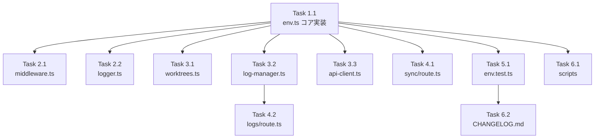

# 作業計画書: Issue #76

## Issue概要

| 項目 | 内容 |
|------|------|
| **Issue番号** | #76 |
| **タイトル** | Phase 1: 環境変数フォールバック実装 + CHANGELOG作成 (CommandMate リネーム) |
| **サイズ** | M（中規模） |
| **優先度** | High |
| **親Issue** | #74 (Rename/Brand update: MyCodeBranchDesk → CommandMate) |
| **破壊的変更** | なし（後方互換性維持） |

---

## 作業計画

### Phase 1: コア実装（優先度: 最高）

#### Task 1.1: フォールバック機能のコア実装

**対象ファイル**: `src/lib/env.ts`

| チェック | 作業内容 |
|---------|---------|
| [ ] | `ENV_MAPPING`定数を追加（8種類の環境変数マッピング） |
| [ ] | `warnedKeys` Setを追加（警告重複防止用） |
| [ ] | `resetWarnedKeys()`関数を追加（テスト用） |
| [ ] | `getEnvWithFallback()`関数を実装 |
| [ ] | `getEnvByKey()`型安全版関数を実装 |
| [ ] | `getLogConfig()`をフォールバック対応に更新 |
| [ ] | `getEnv()`をフォールバック対応に更新 |

**成果物**:
```typescript
export const ENV_MAPPING = {
  CM_ROOT_DIR: 'MCBD_ROOT_DIR',
  CM_PORT: 'MCBD_PORT',
  CM_BIND: 'MCBD_BIND',
  CM_AUTH_TOKEN: 'MCBD_AUTH_TOKEN',
  CM_LOG_LEVEL: 'MCBD_LOG_LEVEL',
  CM_LOG_FORMAT: 'MCBD_LOG_FORMAT',
  CM_LOG_DIR: 'MCBD_LOG_DIR',
  CM_DB_PATH: 'MCBD_DB_PATH',
} as const;
```

---

### Phase 2: 認証・ミドルウェア層（優先度: 高）

#### Task 2.1: ミドルウェア更新

**対象ファイル**: `src/middleware.ts`

| チェック | 作業内容 |
|---------|---------|
| [ ] | 相対パスで`getEnvWithFallback`をインポート（`./lib/env`） |
| [ ] | `MCBD_BIND`参照をフォールバック対応（25行目） |
| [ ] | `MCBD_AUTH_TOKEN`参照をフォールバック対応（34行目） |

#### Task 2.2: ロガーマスキング更新

**対象ファイル**: `src/lib/logger.ts`

| チェック | 作業内容 |
|---------|---------|
| [ ] | `CM_AUTH_TOKEN`マスキングパターンを追加（82-83行目付近） |

---

### Phase 3: データアクセス層（優先度: 中）

#### Task 3.1: ワークツリー管理更新

**対象ファイル**: `src/lib/worktrees.ts`

| チェック | 作業内容 |
|---------|---------|
| [ ] | `getEnvByKey`をインポート |
| [ ] | `MCBD_ROOT_DIR`参照をフォールバック対応（134行目） |

#### Task 3.2: ログマネージャー更新

**対象ファイル**: `src/lib/log-manager.ts`

| チェック | 作業内容 |
|---------|---------|
| [ ] | `getEnvByKey`をインポート |
| [ ] | `MCBD_LOG_DIR`参照をフォールバック対応（13行目） |

#### Task 3.3: APIクライアント更新

**対象ファイル**: `src/lib/api-client.ts`

| チェック | 作業内容 |
|---------|---------|
| [ ] | `clientAuthTokenWarned`フラグを追加 |
| [ ] | `NEXT_PUBLIC_CM_AUTH_TOKEN`へのフォールバック実装 |
| [ ] | 警告重複防止ロジックを追加 |

---

### Phase 4: APIエンドポイント層（優先度: 中）

#### Task 4.1: sync/route.ts更新

**対象ファイル**: `src/app/api/repositories/sync/route.ts`

| チェック | 作業内容 |
|---------|---------|
| [ ] | エラーメッセージに新名称`CM_ROOT_DIR (MCBD_ROOT_DIR)`を追加（17行目） |

#### Task 4.2: logs/[filename]/route.ts更新

**対象ファイル**: `src/app/api/worktrees/[id]/logs/[filename]/route.ts`

| チェック | 作業内容 |
|---------|---------|
| [ ] | `getEnvByKey`をインポート |
| [ ] | `MCBD_LOG_DIR`参照をフォールバック対応（12行目） |

---

### Phase 5: テスト実装（優先度: 高）

#### Task 5.1: フォールバックテスト新規作成

**対象ファイル**: `tests/unit/env.test.ts`（新規）

| チェック | テストケース |
|---------|------------|
| [ ] | 新名称のみ設定時の動作テスト |
| [ ] | 旧名称のみ設定時のフォールバック動作テスト |
| [ ] | 両方設定時に新名称が優先されるテスト |
| [ ] | 両方未設定時のundefined返却テスト |
| [ ] | 空文字列が有効値として扱われるテスト |
| [ ] | 警告重複防止のテスト（同一キー複数回） |
| [ ] | resetWarnedKeysのテスト |
| [ ] | ENV_MAPPINGの網羅性テスト（8種類） |

---

### Phase 6: スクリプト・ドキュメント（優先度: 低）

#### Task 6.1: マイグレーションスクリプト更新

**対象ファイル**: `scripts/migrate-cli-tool-id.ts`

| チェック | 作業内容 |
|---------|---------|
| [ ] | `MCBD_DB_PATH`参照をフォールバック対応（13行目） |

**対象ファイル**: `scripts/clean-existing-messages.ts`

| チェック | 作業内容 |
|---------|---------|
| [ ] | `MCBD_DB_PATH`参照をフォールバック対応（10行目） |

#### Task 6.2: CHANGELOG新規作成

**対象ファイル**: `CHANGELOG.md`（新規）

| チェック | 作業内容 |
|---------|---------|
| [ ] | Keep a Changelogフォーマットで新規作成 |
| [ ] | [Unreleased]セクションに本Issue変更を記載 |

---

## タスク依存関係



---

## 品質チェック項目

| チェック項目 | コマンド | 基準 |
|-------------|----------|------|
| ESLint | `npm run lint` | エラー0件 |
| TypeScript | `npx tsc --noEmit` | 型エラー0件 |
| Unit Test | `npm run test:unit` | 全テストパス |
| Build | `npm run build` | 成功 |

---

## 成果物チェックリスト

### コード（11ファイル）

| 状態 | ファイル | 変更内容 |
|------|---------|---------|
| [ ] | `src/lib/env.ts` | フォールバック機能追加 |
| [ ] | `src/middleware.ts` | 認証フォールバック |
| [ ] | `src/lib/logger.ts` | マスキングパターン追加 |
| [ ] | `src/lib/worktrees.ts` | ROOT_DIRフォールバック |
| [ ] | `src/lib/log-manager.ts` | LOG_DIRフォールバック |
| [ ] | `src/lib/api-client.ts` | クライアント認証フォールバック |
| [ ] | `src/app/api/repositories/sync/route.ts` | エラーメッセージ更新 |
| [ ] | `src/app/api/worktrees/[id]/logs/[filename]/route.ts` | LOG_DIRフォールバック |
| [ ] | `scripts/migrate-cli-tool-id.ts` | DB_PATHフォールバック |
| [ ] | `scripts/clean-existing-messages.ts` | DB_PATHフォールバック |

### テスト（1ファイル新規）

| 状態 | ファイル | 内容 |
|------|---------|------|
| [ ] | `tests/unit/env.test.ts` | フォールバック機能テスト（8ケース） |

### ドキュメント（1ファイル新規）

| 状態 | ファイル | 内容 |
|------|---------|------|
| [ ] | `CHANGELOG.md` | Keep a Changelog形式 |

---

## Definition of Done

Issue完了条件：

| 状態 | 条件 |
|------|------|
| [ ] | 新環境変数名（`CM_*`）で正常に動作する |
| [ ] | 旧環境変数名（`MCBD_*`）でも正常に動作する（フォールバック） |
| [ ] | 旧名称使用時にdeprecation warningがログ出力される |
| [ ] | 同一キーへの警告は1回のみ出力される |
| [ ] | 全8種類の環境変数がフォールバック対応されている |
| [ ] | `NEXT_PUBLIC_MCBD_AUTH_TOKEN`のフォールバック対応が実装されている |
| [ ] | `CM_AUTH_TOKEN`がlogger.tsでマスキング対象に追加されている |
| [ ] | sync/route.tsのエラーメッセージに新名称が追加されている |
| [ ] | フォールバック機能のユニットテストが追加されている |
| [ ] | CHANGELOG.mdが新規作成されている |
| [ ] | TypeScriptコンパイルエラーなし |
| [ ] | ESLintエラーなし |
| [ ] | 既存テストがすべてパスする |
| [ ] | ビルド成功 |

---

## 次のアクション

### 1. ブランチ作成

```bash
git checkout -b feature/76-env-fallback
```

### 2. 実装開始

```bash
# TDD実装を推奨
/tdd-impl #76

# または自動開発フロー
/pm-auto-dev #76
```

### 3. 進捗報告

```bash
/progress-report
```

### 4. PR作成

```bash
/create-pr
```

---

## 関連ドキュメント

| ドキュメント | パス |
|-------------|------|
| 設計方針書 | `dev-reports/design/issue-76-env-fallback-design-policy.md` |
| 整合性レビュー | `dev-reports/review/2026-01-29-issue76-architecture-review.md` |
| 影響範囲レビュー | `dev-reports/review/2026-01-29-issue76-impact-scope-review.md` |

---

**作成日**: 2026-01-29
**作成者**: Work Plan Agent
