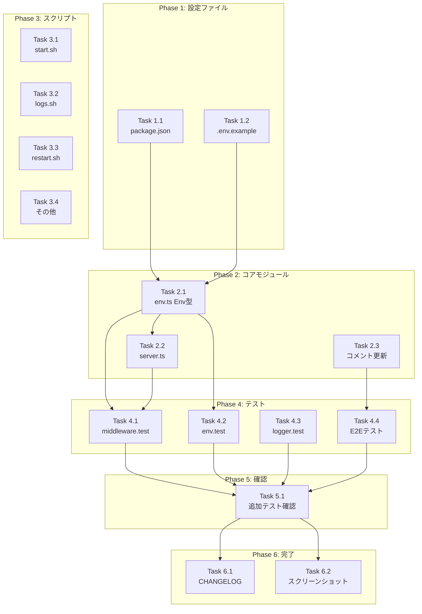

# 作業計画書: Issue #77 Phase 3 - 設定・コード内の名称置換

## Issue: Phase 3: 設定・コード内の名称置換 (CommandMate リネーム)

**Issue番号**: #77
**サイズ**: L (Large)
**優先度**: High
**依存Issue**: #76 (完了済み), #75 (完了済み)
**親Issue**: #74 (Rename/Brand update)

---

## 1. Issue概要

CommandMateリネームの第3フェーズとして、以下を実施：
- 環境変数名の置換（`MCBD_*` → `CM_*`）
- package.json の name 変更
- コード内名称の置換
- テストコードの修正
- シェルスクリプトの更新

**破壊的変更**: あり（フォールバック機能により後方互換性維持）

---

## 2. 詳細タスク分解

### Phase 1: 設定ファイル更新

- [ ] **Task 1.1**: package.json の更新
  - 成果物: `package.json`
  - 変更内容: `name: "mycodebranch-desk"` → `name: "commandmate"`
  - 依存: なし

- [ ] **Task 1.2**: .env.example の更新
  - 成果物: `.env.example`
  - 変更内容: 全環境変数を `CM_*` に更新、deprecation情報追加
  - 依存: なし

### Phase 2: コアモジュール更新

- [ ] **Task 2.1**: Envインターフェース変更
  - 成果物: `src/lib/env.ts`
  - 変更内容:
    - Envインターフェースのプロパティ名を `CM_*` に変更
    - `getEnv()` の戻り値を更新
  - 依存: Task 1.1, 1.2
  - レビューID: MF-1

- [ ] **Task 2.2**: server.ts フォールバック対応
  - 成果物: `server.ts`
  - 変更内容: `getEnvByKey()` を使用してフォールバック対応
  - 依存: Task 2.1
  - レビューID: MF-2

- [ ] **Task 2.3**: コメント・ドキュメント更新
  - 成果物:
    - `src/lib/worktrees.ts` - コメント更新
    - `src/lib/logger.ts` - モジュールコメント更新
    - `src/components/layout/Header.tsx` - JSDocコメント更新
  - 依存: なし
  - レビューID: SF-3, SF-4, Stage2 MF-3

### Phase 3: シェルスクリプト更新

- [ ] **Task 3.1**: scripts/start.sh 更新
  - 成果物: `scripts/start.sh`
  - 変更内容: APP_NAME、コメント、systemdサービス名を更新
  - 依存: なし
  - レビューID: Stage2 MF-1

- [ ] **Task 3.2**: scripts/logs.sh 更新
  - 成果物: `scripts/logs.sh`
  - 変更内容: APP_NAME、コメント更新
  - 依存: なし
  - レビューID: Stage2 MF-1

- [ ] **Task 3.3**: scripts/restart.sh 更新
  - 成果物: `scripts/restart.sh`
  - 変更内容: APP_NAME、コメント更新
  - 依存: なし
  - レビューID: Stage2 MF-1

- [ ] **Task 3.4**: その他スクリプトの確認と更新
  - 成果物:
    - `scripts/stop.sh`
    - `scripts/stop-server.sh`
    - `scripts/status.sh`
    - `scripts/health-check.sh`
    - `scripts/build-and-start.sh`
    - `scripts/setup.sh`
    - `scripts/*.ts` (TypeScriptスクリプト)
  - 依存: なし

### Phase 4: テストコード更新

- [ ] **Task 4.1**: middleware.test.ts 更新
  - 成果物: `tests/unit/middleware.test.ts`
  - 変更内容:
    - 既存テストを `CM_*` に更新
    - フォールバックテストを追加
  - 依存: Task 2.1, 2.2
  - レビューID: MF-3

- [ ] **Task 4.2**: env.test.ts 更新
  - 成果物: `tests/unit/env.test.ts`
  - 変更内容: 戻り値のアサーションを `CM_*` に更新
  - 依存: Task 2.1
  - レビューID: MF-1

- [ ] **Task 4.3**: logger.test.ts 更新
  - 成果物: `tests/unit/logger.test.ts`
  - 変更内容: `CM_AUTH_TOKEN` リダクションテスト追加
  - 依存: なし
  - レビューID: Stage3 SF-1

- [ ] **Task 4.4**: E2Eテスト更新
  - 成果物: `tests/e2e/worktree-list.spec.ts`
  - 変更内容:
    - `MyCodeBranchDesk` → `CommandMate` 更新
    - `test.skip()` を解除
  - 依存: Task 2.3
  - レビューID: Stage2 MF-2

### Phase 5: 追加対象ファイル確認

- [ ] **Task 5.1**: 追加テストファイル確認
  - 確認対象:
    - `tests/unit/db.test.ts`
    - `tests/unit/db-repository-delete.test.ts`
    - `tests/unit/db-viewed-tracking.test.ts`
    - `tests/integration/api-repository-delete.test.ts`
    - `tests/e2e/worktree-detail.spec.ts`
    - `tests/e2e/cli-tool-selection.spec.ts`
  - 依存: Task 4.1-4.4

### Phase 6: ドキュメント・その他

- [ ] **Task 6.1**: CHANGELOG.md 更新
  - 成果物: `CHANGELOG.md`
  - 変更内容: 破壊的変更の記載
  - 依存: Phase 1-5完了

- [ ] **Task 6.2**: スクリーンショット差し替え（オプション）
  - 成果物:
    - `docs/images/screenshot-desktop.png`
    - `docs/images/screenshot-mobile.png`
    - `docs/images/screenshot-worktree-desktop.png`
    - `docs/images/screenshot-worktree-mobile.png`
    - `docs/images/screenshot-worktree-mobile-terminal.png`
  - 依存: Phase 1-5完了

---

## 3. タスク依存関係



---

## 4. 品質チェック項目

| チェック項目 | コマンド | 基準 |
|-------------|----------|------|
| TypeScript | `npx tsc --noEmit` | 型エラー0件 |
| ESLint | `npm run lint` | エラー0件 |
| Unit Test | `npm run test:unit` | 全テストパス |
| Integration Test | `npm run test:integration` | 全テストパス |
| E2E Test | `npm run test:e2e` | 全テストパス |
| Build | `npm run build` | 成功 |

---

## 5. 成果物チェックリスト

### 設定ファイル
- [ ] `package.json` - name が `commandmate`
- [ ] `.env.example` - 全環境変数が `CM_*`

### コアモジュール
- [ ] `src/lib/env.ts` - Env型が `CM_*`
- [ ] `server.ts` - `getEnvByKey()` 使用
- [ ] `src/lib/worktrees.ts` - コメント更新
- [ ] `src/lib/logger.ts` - コメント更新
- [ ] `src/components/layout/Header.tsx` - JSDoc更新

### シェルスクリプト
- [ ] `scripts/start.sh` - APP_NAME=commandmate
- [ ] `scripts/logs.sh` - APP_NAME=commandmate
- [ ] `scripts/restart.sh` - APP_NAME=commandmate
- [ ] その他スクリプト確認済み

### テスト
- [ ] `tests/unit/middleware.test.ts` - CM_* + フォールバック
- [ ] `tests/unit/env.test.ts` - CM_* アサーション
- [ ] `tests/unit/logger.test.ts` - CM_AUTH_TOKEN リダクション
- [ ] `tests/e2e/worktree-list.spec.ts` - CommandMate表示

### ドキュメント
- [ ] `CHANGELOG.md` - 破壊的変更記載

---

## 6. Definition of Done

Issue完了条件：

### 必須条件
- [ ] すべてのタスクが完了
- [ ] `package.json` の name が `commandmate`
- [ ] `.env.example` が `CM_*` 環境変数を使用
- [ ] Envインターフェースが `CM_*` プロパティ名
- [ ] `server.ts` が `getEnvByKey()` を使用
- [ ] シェルスクリプトの APP_NAME が `commandmate`
- [ ] TypeScriptコンパイルエラーなし
- [ ] ESLintエラーなし
- [ ] 全テストパス（unit, integration, e2e）
- [ ] ビルド成功
- [ ] `CHANGELOG.md` 更新済み

### 品質基準
- [ ] CIチェック全パス
- [ ] コードレビュー承認

---

## 7. リスクと対策

| リスク | 影響 | 対策 |
|-------|------|------|
| Envインターフェース変更による破壊的変更 | getEnv()使用箇所全てに影響 | フォールバック関数は継続サポート |
| PM2プロセス名変更 | 既存デプロイ環境への影響 | ロールバック手順を準備 |
| テスト漏れ | 環境変数参照箇所の見落とし | grep で全検索後に実装 |

### ロールバック計画

```bash
# コード変更のロールバック
git revert <commit-hash>

# .env ファイルの復元（必要に応じて）
# フォールバック機能により MCBD_* は継続動作
```

---

## 8. 次のアクション

作業計画承認後：

1. **ブランチ作成**: `feature/77-rename-phase3-settings-code`
2. **タスク実行**: Phase 1 → Phase 6 の順序で実装
3. **進捗報告**: `/progress-report` で定期報告
4. **PR作成**: `/create-pr` で自動作成

### 推奨実行コマンド

```bash
# TDD実装を推奨
/tdd-impl 77

# または自動開発フロー
/pm-auto-dev 77
```

---

## 9. 参照ドキュメント

- [設計方針書](./dev-reports/design/issue-77-rename-phase3-design-policy.md)
- [マルチステージレビュー結果](./dev-reports/issue/77/multi-stage-review/summary-report.md)
- [Issue #76 設計書](./dev-reports/design/issue-76-env-fallback-design-policy.md)
- [Issue #77 (GitHub)](https://github.com/Kewton/MyCodeBranchDesk/issues/77)

---

## 10. 作業見積もり

| Phase | タスク数 | 複雑度 |
|-------|---------|--------|
| Phase 1: 設定ファイル | 2 | Low |
| Phase 2: コアモジュール | 3 | Medium |
| Phase 3: スクリプト | 4 | Low |
| Phase 4: テスト | 4 | Medium |
| Phase 5: 確認 | 1 | Low |
| Phase 6: ドキュメント | 2 | Low |

**総タスク数**: 16
**ファイル変更数**: 約20-30ファイル

---

*作成日: 2026-01-29*
*最終更新: 2026-01-29*
