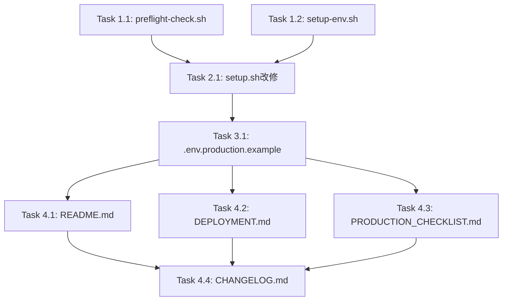

# 作業計画書 - Issue #92

## Issue: セットアップ手順の簡素化と事前チェック機能の追加

**Issue番号**: #92
**サイズ**: M（中規模）
**優先度**: High
**作成日**: 2026-01-30

---

## 概要

セットアップ手順を簡素化し、必要な依存アプリの事前チェック機能を追加する。
新規スクリプト2本、既存スクリプト改修1本、ドキュメント更新4本の作業。

---

## タスク分解

### Phase 1: 新規スクリプト作成

#### Task 1.1: `scripts/preflight-check.sh` 作成
- **成果物**: `scripts/preflight-check.sh`
- **内容**:
  - 依存チェック機能（Node.js v20+, npm, tmux, git, openssl）
  - Claude CLI は警告のみ（続行可能）
  - ヘルプオプション（`-h`/`--help`）
  - 適切な終了コード
- **参考**: Issue記載の出力例に従う

```bash
# チェック項目
- node -v           # v20+ 必須
- npm -v            # 必須
- tmux -V           # 必須
- git --version     # 必須
- openssl version   # 必須
- claude --version  # 警告のみ
```

#### Task 1.2: `scripts/setup-env.sh` 作成
- **成果物**: `scripts/setup-env.sh`
- **内容**:
  - 対話式 `.env` 生成（`CM_*` 形式）
  - 既存 `.env` のバックアップ（`.env.backup.{timestamp}`）
  - トークン自動生成（`openssl rand -hex 32`）
  - 高度な設定（ログ関連）はスキップ可能
  - ヘルプオプション（`-h`/`--help`）

```bash
# 対応する環境変数
- CM_ROOT_DIR      # 必須、対話式入力
- CM_PORT          # デフォルト: 3000
- CM_BIND          # デフォルト: localhost
- CM_AUTH_TOKEN    # 外部アクセス時に自動生成
- CM_DB_PATH       # デフォルト: ./data/cm.db
- CM_LOG_*         # 高度な設定
```

### Phase 2: 既存スクリプト改修

#### Task 2.1: `scripts/setup.sh` 改修
- **成果物**: `scripts/setup.sh`（更新）
- **内容**:
  - `preflight-check.sh` 呼び出し追加
  - `.env` 未存在時は `setup-env.sh` を呼び出し
  - 既存の `.env.production.example` コピー処理を削除
  - 環境変数案内メッセージを `CM_*` 形式に統一

```bash
# 新しいフロー
1. ./scripts/preflight-check.sh || exit 1
2. npm install
3. if [ ! -f .env ]; then ./scripts/setup-env.sh; fi
4. npm run db:init
5. npm run build
```

### Phase 3: 設定ファイル更新

#### Task 3.1: `.env.production.example` 更新
- **成果物**: `.env.production.example`（更新）
- **内容**:
  - `MCBD_*` → `CM_*` に変更
  - `DATABASE_PATH` → `CM_DB_PATH` に変更
  - フォールバック対応のコメント追加

### Phase 4: ドキュメント更新

#### Task 4.1: `README.md` 更新
- **成果物**: `README.md`（更新）
- **内容**:
  - Quick Start セクションの簡素化
  - 新しいセットアップフローの記載

```markdown
# 変更後のQuick Start
git clone https://github.com/Kewton/CommandMate.git
cd CommandMate
./scripts/setup.sh
./scripts/build-and-start.sh --daemon
```

#### Task 4.2: `docs/DEPLOYMENT.md` 更新
- **成果物**: `docs/DEPLOYMENT.md`（更新）
- **内容**:
  - 手動セットアップ手順を新スクリプト使用に更新
  - `preflight-check.sh`, `setup-env.sh` の使用方法追加

#### Task 4.3: `docs/internal/PRODUCTION_CHECKLIST.md` 更新
- **成果物**: `docs/internal/PRODUCTION_CHECKLIST.md`（更新）
- **内容**:
  - `MCBD_*` 参照を `CM_*` に更新

#### Task 4.4: `CHANGELOG.md` 更新
- **成果物**: `CHANGELOG.md`（更新）
- **内容**:
  - [Unreleased] セクションに変更点を記録

---

## 依存関係図



---

## 実装順序

| 順序 | タスク | 依存 | 説明 |
|-----|-------|------|------|
| 1 | Task 1.1 | なし | preflight-check.sh 新規作成 |
| 2 | Task 1.2 | なし | setup-env.sh 新規作成 |
| 3 | Task 2.1 | 1, 2 | setup.sh 改修（新スクリプト統合） |
| 4 | Task 3.1 | 3 | .env.production.example 更新 |
| 5 | Task 4.1 | 4 | README.md 更新 |
| 6 | Task 4.2 | 4 | DEPLOYMENT.md 更新 |
| 7 | Task 4.3 | 4 | PRODUCTION_CHECKLIST.md 更新 |
| 8 | Task 4.4 | 5, 6, 7 | CHANGELOG.md 更新 |

---

## 品質チェック項目

### スクリプトチェック
- [ ] `preflight-check.sh` が実行可能（`chmod +x`）
- [ ] `setup-env.sh` が実行可能（`chmod +x`）
- [ ] 各スクリプトに `-h`/`--help` オプションがある
- [ ] シェバン（`#!/bin/bash`）が正しい
- [ ] `set -e` でエラー時終了が設定されている

### 機能チェック
- [ ] preflight-check.sh: 全依存がある環境で正常終了
- [ ] preflight-check.sh: 依存欠如時にエラー終了
- [ ] preflight-check.sh: Claude CLI未インストールで警告のみ
- [ ] setup-env.sh: 対話式で `.env` 生成
- [ ] setup-env.sh: 既存 `.env` のバックアップ作成
- [ ] setup-env.sh: トークン自動生成
- [ ] setup.sh: 統合フロー実行

### ドキュメントチェック
- [ ] README.md のコマンド例が動作する
- [ ] DEPLOYMENT.md の手順が正確
- [ ] 環境変数名が `CM_*` 形式で統一

---

## 成果物チェックリスト

| 成果物 | 種類 | 完了 |
|--------|------|------|
| `scripts/preflight-check.sh` | 新規 | [ ] |
| `scripts/setup-env.sh` | 新規 | [ ] |
| `scripts/setup.sh` | 更新 | [ ] |
| `.env.production.example` | 更新 | [ ] |
| `README.md` | 更新 | [ ] |
| `docs/DEPLOYMENT.md` | 更新 | [ ] |
| `docs/internal/PRODUCTION_CHECKLIST.md` | 更新 | [ ] |
| `CHANGELOG.md` | 更新 | [ ] |

---

## テスト計画

### 手動テスト（必須）

#### preflight-check.sh
1. 全依存がある環境で実行 → 正常終了
2. Node.js未インストール環境で実行 → エラー終了
3. Claude CLI未インストール環境で実行 → 警告表示後に続行
4. `-h` オプションで実行 → ヘルプ表示

#### setup-env.sh
1. `.env` 未存在時に実行 → 新規 `.env` 生成
2. `.env` 存在時に実行 → バックアップ作成後に新規生成
3. 外部アクセス許可選択 → トークン自動生成
4. `-h` オプションで実行 → ヘルプ表示

#### setup.sh（統合テスト）
1. クリーンな環境で実行 → 全フロー完了
2. `.env` 存在環境で実行 → setup-env.sh スキップ

---

## リスクと対策

| リスク | 影響 | 対策 |
|--------|------|------|
| 既存ユーザーの `.env` 破損 | 高 | バックアップ機能を必須実装 |
| bash 互換性問題 | 中 | bash 4.0+ を前提とし明記 |
| 対話式入力の誤り | 低 | デフォルト値を適切に設定 |

---

## 次のアクション

1. ブランチ作成: `feature/92-setup-simplification`
2. Task 1.1, 1.2 を並行実装（依存なし）
3. Task 2.1 実装（1.1, 1.2 完了後）
4. テスト実施
5. ドキュメント更新（Phase 4）
6. PR作成

---

*Generated by /work-plan command*
