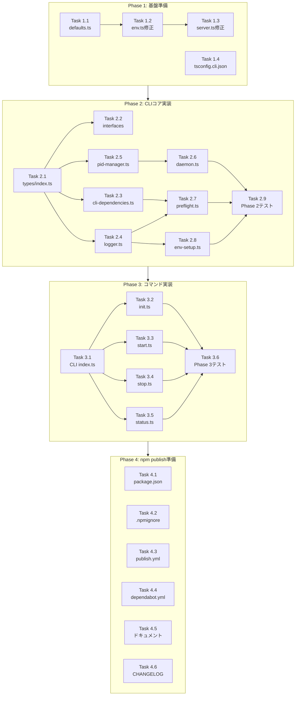

# Issue #96 作業計画書

## Issue概要

**タイトル**: npm installからセットアップ可能にする
**Issue番号**: #96
**サイズ**: L（Large）
**優先度**: High
**依存Issue**: #76（環境変数フォールバック - 完了済み）
**ラベル**: feature

---

## 作業概要

CommandMateを`npm install -g commandmate`でグローバルインストールし、CLIコマンド（init, start, stop, status）でセットアップから起動までを完結できるようにする。

---

## 詳細タスク分解

### Phase 1: 基盤準備（1-2日）

**目標**: CLI実装の前提条件を整備

#### Task 1.1: 共通デフォルト値モジュール作成
- **成果物**: `src/config/defaults.ts`
- **依存**: なし
- **詳細**:
  - ENV_DEFAULTS定数を定義（CM_PORT, CM_BIND, CM_DB_PATH, CM_LOG_LEVEL, CM_LOG_FORMAT）
  - EnvDefaultsType型をexport

#### Task 1.2: src/lib/env.tsの修正
- **成果物**: `src/lib/env.ts`（修正）
- **依存**: Task 1.1
- **詳細**:
  - defaults.tsからENV_DEFAULTSをインポート
  - DBファイル名をdb.sqlite → cm.dbに統一
  - 既存テスト（env.test.ts）の更新

#### Task 1.3: server.tsの環境変数参照修正
- **成果物**: `server.ts`（修正）
- **依存**: Task 1.2
- **詳細**:
  - MCBD_BIND/MCBD_PORT → getEnvByKey('CM_BIND')/getEnvByKey('CM_PORT')に変更
  - getEnvByKeyをインポート

#### Task 1.4: CLIビルド設定
- **成果物**: `tsconfig.cli.json`
- **依存**: なし
- **詳細**:
  - noEmit: falseで出力有効化
  - outDir: dist/cli
  - include: src/cli/**/*

**Phase 1 完了条件**:
- [ ] npm run build が成功
- [ ] npm run dev でサーバー起動確認
- [ ] 既存テストがパス

---

### Phase 2: CLIコア実装（3-5日）

**目標**: CLIユーティリティの基盤構築

#### Task 2.1: CLI共通型定義
- **成果物**: `src/cli/types/index.ts`
- **依存**: Phase 1完了
- **詳細**:
  - ExitCode enum（SUCCESS=0, DEPENDENCY_ERROR=1, CONFIG_ERROR=2, START_FAILED=3, STOP_FAILED=4, UNEXPECTED_ERROR=99）
  - CLIオプション型定義

#### Task 2.2: 抽象化インターフェース
- **成果物**:
  - `src/cli/interfaces/preflight-checker.ts`
  - `src/cli/interfaces/env-setup.ts`
  - `src/cli/interfaces/daemon-manager.ts`
- **依存**: Task 2.1
- **詳細**:
  - IPreflightChecker、IEnvSetup、IDaemonManagerインターフェース定義

#### Task 2.3: 依存関係定義モジュール
- **成果物**: `src/cli/config/cli-dependencies.ts`
- **依存**: Task 2.1
- **詳細**:
  - DependencyCheck型定義
  - loadDependencies()関数
  - DEFAULT_DEPENDENCIES配列（Node.js, npm, tmux, git, openssl, Claude CLI）

#### Task 2.4: CLIロガー
- **成果物**: `src/cli/utils/logger.ts`
- **依存**: Task 2.1
- **詳細**:
  - 色付きログ出力（success/error/warning/info）
  - スピナー表示（オプション）

#### Task 2.5: PIDファイル管理
- **成果物**: `src/cli/utils/pid-manager.ts`
- **依存**: Task 2.1
- **詳細**:
  - PidManagerクラス
  - writePid()（O_EXCLフラグでアトミック書き込み）
  - readPid(), removePid(), exists(), isProcessRunning()

#### Task 2.6: デーモン管理
- **成果物**: `src/cli/utils/daemon.ts`
- **依存**: Task 2.5
- **詳細**:
  - startDaemon()（detached spawn）
  - stopDaemon()（SIGTERM/SIGKILL）
  - getDaemonStatus()

#### Task 2.7: 依存関係チェック
- **成果物**: `src/cli/utils/preflight.ts`
- **依存**: Task 2.3, Task 2.4
- **詳細**:
  - scripts/preflight-check.shのTypeScript移植
  - checkAll(), checkDependency()
  - spawn使用（execSync禁止 - コマンドインジェクション対策）

#### Task 2.8: 環境設定
- **成果物**: `src/cli/utils/env-setup.ts`
- **依存**: Task 1.1, Task 2.4
- **詳細**:
  - scripts/setup-env.shのTypeScript移植
  - createEnvFile(), backupExisting(), validateConfig()
  - 対話形式入力のサニタイズ

#### Task 2.9: Phase 2 ユニットテスト
- **成果物**:
  - `tests/unit/cli/pid-manager.test.ts`
  - `tests/unit/cli/daemon.test.ts`
  - `tests/unit/cli/preflight.test.ts`
  - `tests/unit/cli/env-setup.test.ts`
- **依存**: Task 2.5〜2.8

**Phase 2 完了条件**:
- [ ] 各ユーティリティのユニットテストがパス
- [ ] npm run build:cli が成功

---

### Phase 3: コマンド実装（2-3日）

**目標**: ユーザー向け機能の実装

#### Task 3.1: CLIエントリポイント
- **成果物**:
  - `bin/commandmate.js`
  - `src/cli/index.ts`
- **依存**: Phase 2完了
- **詳細**:
  - shebang (#!/usr/bin/env node)
  - commander設定（バージョン、ヘルプ自動生成）
  - サブコマンド登録

#### Task 3.2: initコマンド
- **成果物**: `src/cli/commands/init.ts`
- **依存**: Task 3.1, Task 2.7, Task 2.8
- **詳細**:
  - preflight check実行
  - .env作成（対話形式 or --defaults）
  - DB初期化（scripts/init-db.ts呼び出し）
  - オプション: --defaults, --force

#### Task 3.3: startコマンド
- **成果物**: `src/cli/commands/start.ts`
- **依存**: Task 3.1, Task 2.6
- **詳細**:
  - フォアグラウンド起動（デフォルト）
  - --daemon: バックグラウンド起動
  - --dev: 開発モード
  - npm start内部実行方式

#### Task 3.4: stopコマンド
- **成果物**: `src/cli/commands/stop.ts`
- **依存**: Task 3.1, Task 2.6
- **詳細**:
  - PIDファイルからプロセス停止
  - --force: SIGKILL使用

#### Task 3.5: statusコマンド
- **成果物**: `src/cli/commands/status.ts`
- **依存**: Task 3.1, Task 2.6
- **詳細**:
  - サーバー状態表示（Running/Stopped）
  - PID、ポート、Uptime、URL表示

#### Task 3.6: Phase 3 テスト
- **成果物**:
  - `tests/unit/cli/commands/init.test.ts`
  - `tests/unit/cli/commands/start.test.ts`
  - `tests/unit/cli/commands/stop.test.ts`
  - `tests/unit/cli/commands/status.test.ts`
  - `tests/integration/cli/workflow.test.ts`（統合テスト）
- **依存**: Task 3.2〜3.5

**Phase 3 完了条件**:
- [ ] commandmate --version が動作
- [ ] commandmate init/start/stop/status が動作
- [ ] 統合テスト（init -> start -> status -> stop）がパス

---

### Phase 4: npm publish準備（1-2日）

**目標**: リリース準備

#### Task 4.1: package.json更新
- **成果物**: `package.json`（修正）
- **依存**: Phase 3完了
- **詳細**:
  - private: false（npm publish直前に変更）
  - bin フィールド追加
  - files フィールド追加
  - commander依存関係追加

#### Task 4.2: .npmignore作成
- **成果物**: `.npmignore`
- **依存**: なし
- **詳細**:
  - tests/, dev-reports/, docs/, .github/, workspace/除外
  - .env*, *.log, *.db除外
  - セキュリティパターン（credentials, secrets等）

#### Task 4.3: npm publishワークフロー
- **成果物**: `.github/workflows/publish.yml`
- **依存**: なし
- **詳細**:
  - トリガー: release published
  - テスト実行 → ビルド → npm publish
  - NPM_TOKEN使用（GitHub Secrets）
  - provenance有効化（--provenance）
  - id-token: write権限

#### Task 4.4: 依存関係脆弱性チェック設定
- **成果物**: `.github/dependabot.yml`
- **依存**: なし
- **詳細**:
  - npm更新設定
  - 週次チェック

#### Task 4.5: ドキュメント更新
- **成果物**:
  - `README.md`（修正）
  - `CLAUDE.md`（修正）
  - `docs/DEPLOYMENT.md`（新規/修正）
  - `docs/cli-reference.md`（新規）
- **依存**: Phase 3完了
- **詳細**:
  - npmインストール手順
  - CLIコマンドリファレンス
  - 本格運用向け推奨事項（PM2/systemd/Docker）

#### Task 4.6: CHANGELOGとマイグレーションガイド
- **成果物**:
  - `CHANGELOG.md`（修正）
  - `docs/migration-to-commandmate.md`（修正）
- **依存**: なし
- **詳細**:
  - CM_DB_PATH破壊的変更の記載
  - マイグレーション手順

**Phase 4 完了条件**:
- [ ] npm pack でパッケージ作成成功
- [ ] ローカルでnpm install -g ./commandmate-*.tgzが成功
- [ ] ドキュメントが完成

---

## タスク依存関係図

---

## 品質チェック項目

| チェック項目 | コマンド | 基準 |
|-------------|----------|------|
| ESLint | `npm run lint` | エラー0件 |
| TypeScript | `npx tsc --noEmit` | 型エラー0件 |
| Unit Test | `npm run test:unit` | 全テストパス、カバレッジ80%以上 |
| CLI Build | `npm run build:cli` | 成功 |
| Build | `npm run build` | 成功 |

---

## 成果物チェックリスト

### コード（新規作成）
- [ ] `src/config/defaults.ts`
- [ ] `src/cli/types/index.ts`
- [ ] `src/cli/interfaces/preflight-checker.ts`
- [ ] `src/cli/interfaces/env-setup.ts`
- [ ] `src/cli/interfaces/daemon-manager.ts`
- [ ] `src/cli/config/cli-dependencies.ts`
- [ ] `src/cli/utils/logger.ts`
- [ ] `src/cli/utils/pid-manager.ts`
- [ ] `src/cli/utils/daemon.ts`
- [ ] `src/cli/utils/preflight.ts`
- [ ] `src/cli/utils/env-setup.ts`
- [ ] `src/cli/index.ts`
- [ ] `src/cli/commands/init.ts`
- [ ] `src/cli/commands/start.ts`
- [ ] `src/cli/commands/stop.ts`
- [ ] `src/cli/commands/status.ts`
- [ ] `bin/commandmate.js`
- [ ] `tsconfig.cli.json`
- [ ] `.npmignore`
- [ ] `.github/workflows/publish.yml`
- [ ] `.github/dependabot.yml`

### コード（修正）
- [ ] `src/lib/env.ts`（デフォルト値参照変更、DB名統一）
- [ ] `server.ts`（getEnvByKey使用）
- [ ] `package.json`（bin, files, dependencies追加）

### テスト
- [ ] `tests/unit/cli/pid-manager.test.ts`
- [ ] `tests/unit/cli/daemon.test.ts`
- [ ] `tests/unit/cli/preflight.test.ts`
- [ ] `tests/unit/cli/env-setup.test.ts`
- [ ] `tests/unit/cli/commands/init.test.ts`
- [ ] `tests/unit/cli/commands/start.test.ts`
- [ ] `tests/unit/cli/commands/stop.test.ts`
- [ ] `tests/unit/cli/commands/status.test.ts`
- [ ] `tests/integration/cli/workflow.test.ts`
- [ ] `tests/unit/env.test.ts`（修正: デフォルト値更新）

### ドキュメント
- [ ] `README.md`（npmインストール手順追加）
- [ ] `CLAUDE.md`（開発コマンド追加）
- [ ] `docs/DEPLOYMENT.md`（本格運用向け推奨事項）
- [ ] `docs/cli-reference.md`（CLIリファレンス）
- [ ] `CHANGELOG.md`（破壊的変更記載）
- [ ] `docs/migration-to-commandmate.md`（マイグレーション手順更新）

---

## セキュリティチェックリスト

設計レビュー（Stage 4）で指摘されたセキュリティ対策:

- [ ] **MF-SEC-1**: execSync使用禁止、spawn配列引数形式を使用
- [ ] **MF-SEC-2**: PIDファイルのアトミック書き込み（O_EXCL）
- [ ] **MF-SEC-3**: npm provenanceの有効化
- [ ] **SF-SEC-1**: .envファイルパーミッション0600
- [ ] **SF-SEC-3**: 対話入力のサニタイズ
- [ ] **SF-SEC-4**: npm audit自動化
- [ ] **SF-SEC-5**: .npmignoreセキュリティパターン

---

## Definition of Done

Issue完了条件:
- [ ] すべてのタスクが完了
- [ ] 単体テストカバレッジ80%以上
- [ ] CIチェック全パス（lint, type-check, test, build）
- [ ] セキュリティチェックリスト全項目完了
- [ ] ドキュメント更新完了
- [ ] npm pack でパッケージ作成成功
- [ ] ローカルでのグローバルインストールとコマンド実行確認

---

## 次のアクション

作業計画承認後:
1. **ブランチ作成**: `feature/96-npm-cli-install`
2. **Phase 1から順次実装**: 計画に従って実装
3. **進捗報告**: `/progress-report`で定期報告
4. **PR作成**: `/create-pr`で自動作成

---

## 関連ドキュメント

- **設計方針書**: `dev-reports/design/issue-96-npm-cli-design-policy.md`
- **設計レビュー結果**: `dev-reports/issue/96/multi-stage-design-review/summary-report.md`
- **Issueレビュー結果**: `dev-reports/issue/96/issue-review/summary-report.md`

---

*Generated by /work-plan command*
