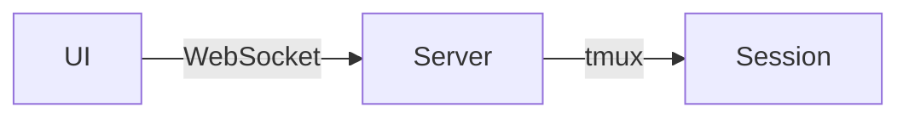

# アーキテクチャレビュー: Issue #46 エスケープ入力機能

## レビュー概要

| 項目 | 内容 |
|------|------|
| **対象** | Issue #46 設計方針書 |
| **レビュー日** | 2026-01-14 |
| **レビュアー** | Architecture Review Agent |
| **設計書** | `dev-reports/design/issue46-escape-input-design-policy.md` |

---

## 1. 設計原則の遵守確認

### SOLID原則チェック

| 原則 | 評価 | コメント |
|------|------|----------|
| **S**ingle Responsibility | ✅ | `sendSpecialKey`は特殊キー送信のみ、`InterruptButton`はUI表示のみ |
| **O**pen/Closed | ✅ | `ICLITool`インターフェース拡張で既存実装への影響なし |
| **L**iskov Substitution | ✅ | `BaseCLITool.interrupt`のデフォルト実装で全CLIツール対応 |
| **I**nterface Segregation | ✅ | `interrupt`メソッドは独立して追加 |
| **D**ependency Inversion | ✅ | APIはICLIToolインターフェースに依存 |

### その他の原則

| 原則 | 評価 | コメント |
|------|------|----------|
| KISS | ✅ | tmux send-keysの単純な活用、過度な抽象化なし |
| YAGNI | ✅ | 必要最小限の機能（Escapeのみ）、Ctrl+Cは将来拡張へ |
| DRY | ✅ | `sendSpecialKey`で特殊キー送信を一元化 |

---

## 2. アーキテクチャ評価

### 構造的品質

| 評価項目 | スコア | コメント |
|---------|--------|----------|
| モジュール性 | ⭐⭐⭐⭐⭐ | 新規コンポーネントが既存構造に自然に統合 |
| 結合度 | ⭐⭐⭐⭐⭐ | 既存tmux.tsへの最小限の追加 |
| 凝集度 | ⭐⭐⭐⭐⭐ | 各モジュールの責務が明確 |
| 拡張性 | ⭐⭐⭐⭐☆ | ICLITool拡張で将来対応可能、キー種類の拡張余地あり |
| 保守性 | ⭐⭐⭐⭐⭐ | シンプルな実装、テスト容易 |

### パフォーマンス観点

| 項目 | 評価 |
|------|------|
| レスポンスタイム | 優秀（tmux send-keysは即時実行、< 100ms） |
| スループット | 問題なし（単発操作、高頻度呼び出しなし） |
| リソース使用効率 | 優秀（追加プロセスなし） |
| スケーラビリティ | N/A（ローカル単一インスタンス想定） |

---

## 3. セキュリティレビュー

### OWASP Top 10 チェック

| 項目 | 評価 | コメント |
|------|------|----------|
| インジェクション | ✅ | セッション名はシステム生成、ユーザー入力なし |
| 認証の破綻 | ✅ | 既存MCBD_AUTH_TOKEN認証を継続 |
| 機微データの露出 | ✅ | 機微データの取り扱いなし |
| アクセス制御 | ✅ | Worktree存在チェックで認可を担保 |
| セキュリティ設定ミス | ✅ | 新規設定項目なし |
| XSS | ✅ | API応答のみ、HTMLレンダリングなし |

### 追加セキュリティ考慮

| リスク | 対策 | 評価 |
|--------|------|------|
| DoS（連打） | フロントエンドdebounce | ⚠️ 要検討 |
| 不正なセッション操作 | Worktree存在チェック | ✅ |

---

## 4. 既存システムとの整合性

### 統合ポイント

| 項目 | 評価 | コメント |
|------|------|----------|
| API互換性 | ✅ | 既存APIパターンに準拠（`/api/worktrees/:id/*`） |
| データモデル整合性 | ✅ | DB変更なし |
| 認証/認可の一貫性 | ✅ | 既存認証を継続利用 |
| ログ/監視の統合 | ⚠️ | 構造化ログの追加推奨 |

### 技術スタックの適合性

| 項目 | 評価 |
|------|------|
| Next.js 14 | ✅ 完全互換 |
| TypeScript | ✅ 型定義完備 |
| Tailwind CSS | ✅ 既存スタイルパターンに準拠 |
| tmux | ✅ 既存インフラ活用 |

---

## 5. リスク評価

| リスク種別 | 内容 | 影響度 | 発生確率 | 対策優先度 |
|-----------|------|--------|---------|-----------|
| 技術的 | Gemini CLIでのEscape挙動未検証 | 中 | 中 | 中（SF-1） |
| 運用 | 誤操作による意図しない中断 | 低 | 低 | 低 |
| UX | ボタン連打による多重リクエスト | 低 | 中 | 中（SF-2） |
| 互換性 | 既存機能への影響 | 低 | 低 | - |

---

## 6. 改善提案

### 必須改善項目（Must Fix）

なし。設計は堅実で、即座に実装可能。

### 推奨改善項目（Should Fix）

#### [SF-1] Gemini CLI挙動の事前確認

**問題**: Gemini CLIでのEscapeキー挙動が未検証

**提案**:
```markdown
実装前にGemini CLIでの動作確認を実施
- 挙動が異なる場合、GeminiToolクラスでinterrupt()をオーバーライド
```

**影響範囲**: `src/lib/cli-tools/gemini.ts`

#### [SF-2] フロントエンドdebounce実装の明確化

**問題**: debounceの実装詳細が未定義

**提案**:
```typescript
// InterruptButton.tsx
const handleInterrupt = useMemo(
  () => debounce(async () => {
    await interruptApi(worktreeId, cliToolId);
  }, 1000, { leading: true, trailing: false }),
  [worktreeId, cliToolId]
);
```

**理由**: 連打による多重リクエスト防止

#### [SF-3] 構造化ログの追加

**問題**: 設計書にログ出力の記載なし

**提案**:
```typescript
// interrupt/route.ts
import { createLogger } from '@/lib/logger';
const logger = createLogger('interrupt');

logger.info('interrupt:request', { worktreeId, cliToolId });
logger.debug('interrupt:success', { sessionName });
```

**理由**: Issue #41で導入した構造化ログとの整合性

### 検討事項（Consider）

#### [C-1] 中断成功のフィードバック強化

**検討**: 中断成功時にトースト通知を表示
```typescript
// 成功時
toast.success('処理を中断しました');
```

#### [C-2] キーボードショートカット対応（将来）

**検討**: デスクトップでEscキー押下で中断
```typescript
useEffect(() => {
  const handleKeyDown = (e: KeyboardEvent) => {
    if (e.key === 'Escape' && isSessionRunning) {
      handleInterrupt();
    }
  };
  // ...
}, []);
```

---

## 7. ベストプラクティスとの比較

### 業界標準との比較

| 項目 | 業界標準 | 本設計 | 評価 |
|------|---------|--------|------|
| 中断機能 | ストップボタン | ストップボタン | ✅ |
| フィードバック | 視覚的確認 | 設計中（要検討） | ⚠️ |
| エラー処理 | ユーザーへの通知 | 定義済み | ✅ |

### 代替アーキテクチャ案

#### 代替案1: WebSocket経由での中断



- **メリット**: リアルタイム性向上
- **デメリット**: 過剰な複雑性、既存REST APIパターンと不整合
- **判定**: ❌ 不採用（現設計が適切）

#### 代替案2: バックエンドでのレート制限

- **メリット**: より堅牢なDoS対策
- **デメリット**: 過剰な実装コスト
- **判定**: ❌ 不採用（フロントエンドdebounceで十分）

---

## 8. 総合評価

### レビューサマリ

| 項目 | 評価 |
|------|------|
| **全体評価** | ⭐⭐⭐⭐☆（4.5/5） |
| **設計品質** | 優秀 |
| **実装難易度** | 低（既存インフラ活用） |
| **リスク** | 低 |

### 強み

1. **シンプルさ**: 既存tmux.tsの自然な拡張
2. **一貫性**: 既存APIパターン・認証方式を継続
3. **拡張性**: ICLIToolインターフェースで将来対応可能
4. **UX**: モバイル/デスクトップ両対応の明確な設計

### 弱み

1. **Gemini CLI未検証**: 動作確認が必要
2. **フィードバック設計**: 中断成功の視覚的確認が未定義
3. **ログ統合**: 構造化ログの記載なし

### 総評

設計は堅実で、既存アーキテクチャとの整合性が高い。SOLID原則に準拠し、最小限の変更で機能追加が可能。推奨改善項目（SF-1〜SF-3）を設計に反映することで、より完成度の高い実装が可能。

---

## 9. 承認判定

### ✅ 条件付き承認（Conditionally Approved）

以下の条件を満たすことで実装着手可能：

1. **[SF-1]** Gemini CLIでのEscape挙動を事前確認（または実装時に確認）
2. **[SF-2]** debounce実装の詳細を設計書に追記
3. **[SF-3]** 構造化ログ出力を設計に追加

### 次のステップ

1. 設計書に推奨改善項目を反映
2. `/work-plan #46` で作業計画立案
3. `/tdd-impl #46` で実装開始

---

## 10. 改善項目サマリ

| ID | 種別 | 内容 | 優先度 |
|----|------|------|--------|
| SF-1 | Should Fix | Gemini CLI挙動確認 | 中 |
| SF-2 | Should Fix | debounce実装明確化 | 中 |
| SF-3 | Should Fix | 構造化ログ追加 | 中 |
| C-1 | Consider | トースト通知 | 低 |
| C-2 | Consider | キーボードショートカット | 低 |

---

*Generated by Architecture Review Agent - 2026-01-14*
