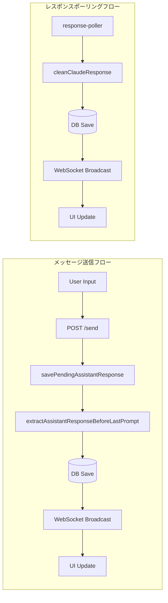

# アーキテクチャレビュー: Issue #54 セッション状態管理の改善（第2版）

**レビュー日時**: 2026-01-16
**対象**: `dev-reports/design/issue54-session-state-management-design-policy.md`（2026-01-16更新版）
**レビュアー**: Claude Code (Architecture Review)
**前回レビュー**: 2026-01-15（条件付き承認）

---

## 1. レビュー概要

### 1.1 前回レビューからの変更点

| 項目 | 前回 | 今回 |
|------|------|------|
| 問題数 | 3件 | 4件（新規追加：保存ロジック問題） |
| 必須改善項目 | 3件（未対応） | 3件（設計に反映済み） |
| 新規追加 | - | `extractAssistantResponseBeforeLastPrompt()`関数 |
| Phase構成 | Phase 1-4 | Phase 1-5（保存ロジック優先） |

### 1.2 本レビューの焦点

1. **新規追加された問題4（保存ロジック）の設計妥当性**
2. **前回指摘の必須改善項目への対応状況**
3. **全体アーキテクチャの整合性**

---

## 2. 設計原則の遵守確認

### SOLID原則チェック

| 原則 | 評価 | コメント |
|------|------|----------|
| **S**ingle Responsibility | :white_check_mark: | `extractAssistantResponseBeforeLastPrompt()`と`cleanClaudeResponse()`の責務分離が明確 |
| **O**pen/Closed | :white_check_mark: | 新関数追加でexisting codeの変更最小化 |
| **L**iskov Substitution | N/A | 継承関係なし |
| **I**nterface Segregation | :white_check_mark: | `StatusDetectionResult`インターフェースが適切に分離 |
| **D**ependency Inversion | :white_check_mark: | `CLIToolType`による抽象化で拡張性確保 |

### その他の原則

| 原則 | 評価 | コメント |
|------|------|----------|
| KISS原則 | :white_check_mark: | 関数分離により複雑性を局所化 |
| YAGNI原則 | :white_check_mark: | Phase 4の無限スクロール削除を確認 |
| DRY原則 | :white_check_mark: | `CLAUDE_SKIP_PATTERNS`の再利用が良好 |

---

## 3. 問題4（保存ロジック）の設計レビュー

### 3.1 問題の根本原因理解

**評価**: :white_check_mark: **正確**

```
tmuxバッファ:
❯ メッセージA（前回のユーザー入力）
[前回のassistant応答 - 保存したい内容]  ← extractAssistantResponseBeforeLastPrompt()で抽出
───
❯ メッセージB（今回のユーザー入力）    ← cleanClaudeResponse()が検出
[Claude処理中...]                      ← cleanClaudeResponse()はここ以降を抽出
```

- `cleanClaudeResponse()`: 最後のプロンプト**以降**を抽出（response-poller用）
- `extractAssistantResponseBeforeLastPrompt()`: 最後のプロンプト**以前**を抽出（savePendingAssistantResponse用）

この分析は正確であり、関数分離の判断は適切です。

### 3.2 提案された解決策の評価

#### `extractAssistantResponseBeforeLastPrompt()`関数

```typescript
export function extractAssistantResponseBeforeLastPrompt(
  output: string,
  cliToolId: CLIToolType
): string {
  // ...
  let lastUserPromptIndex = lines.length;  // 見つからない場合は全行対象
  for (let i = lines.length - 1; i >= 0; i--) {
    if (/^❯\s+\S/.test(lines[i])) {
      lastUserPromptIndex = i;
      break;
    }
  }
  const responseLines = lines.slice(0, lastUserPromptIndex);  // ★ BEFORE
  // ...
}
```

| 評価項目 | スコア | コメント |
|---------|-------|----------|
| 正確性 | 5/5 | `slice(0, lastUserPromptIndex)`で正しく以前の行を抽出 |
| エッジケース処理 | 4/5 | プロンプトが見つからない場合の処理あり（後述） |
| パフォーマンス | 5/5 | O(n)で効率的 |
| 保守性 | 5/5 | 既存パターン（CLAUDE_SKIP_PATTERNS）の再利用 |

### 3.3 エッジケースの検証

| ケース | 入力 | 期待出力 | 設計対応 |
|--------|------|----------|----------|
| 正常ケース | `❯ A\n[response]\n❯ B` | `[response]` | :white_check_mark: |
| プロンプトなし | `[only response]` | `[only response]` | :white_check_mark: `lastUserPromptIndex = lines.length` |
| 空の入力 | `` | `` | :white_check_mark: |
| 連続プロンプト | `❯ A\n❯ B` | `` | :white_check_mark: |
| 応答内に❯含む | `❯ A\n❯ in response\n❯ B` | :warning: | 後述 |

### 3.4 潜在的問題点

#### 問題: Assistant応答内の❯文字

**シナリオ**: Assistantの応答にコードブロックや引用で`❯`が含まれる場合

```
❯ メッセージA
```bash
❯ some command   ← これがプロンプトと誤認される可能性
```
───
❯ メッセージB
```

**現状の設計**:
- パターン `/^❯\s+\S/` は行頭の`❯`のみマッチ
- コードブロック内はインデントされるため多くの場合問題なし

**リスク評価**: **低〜中**
- 発生頻度: 低（コードブロック内の❯は稀）
- 影響度: 中（応答の一部が欠落）

**推奨対策**（Should Fix）:
```typescript
// より厳密なプロンプト検出
const isUserPrompt = (line: string, index: number, lines: string[]): boolean => {
  // 1. 基本パターンチェック
  if (!/^❯\s+\S/.test(line)) return false;

  // 2. 前後の行でコードブロック内かチェック
  const recentLines = lines.slice(Math.max(0, index - 5), index).join('\n');
  if (/```[^`]*$/.test(recentLines)) return false;  // コードブロック内

  return true;
};
```

---

## 4. 前回必須改善項目の対応確認

### 4.1 楽観的UI更新のロールバック機構

**前回指摘**: サーバーエラー時に楽観的に追加したメッセージが残り続ける

**今回の対応**: Section 4.4で対応済み

```typescript
try {
  const response = await worktreeApi.sendMessage(...);
  actions.confirmMessage(tempId, response.userMessage?.id || response.id);
} catch (error) {
  actions.removeMessage(tempId);  // ★ ロールバック
  console.error('[handleMessageSent] Failed to send message:', error);
}
```

**評価**: :white_check_mark: **対応完了**

### 4.2 メモリリーク対策

**前回指摘**: `mergeMessages()`でメッセージが無限に増加する可能性

**今回の対応**: Section 4.3で対応済み

```typescript
export const MAX_MESSAGES = 200;

if (merged.length > maxMessages) {
  return merged.slice(-maxMessages);  // ★ 上限維持
}
```

**評価**: :white_check_mark: **対応完了**

### 4.3 WebSocket切断時のフォールバック

**前回指摘**: WebSocket切断時のフォールバック未定義

**今回の対応**: Section 4.6で対応済み

```typescript
ws.onclose = () => {
  startFallbackPolling();  // ★ ポーリングにフォールバック
  if (reconnectAttempts < MAX_RECONNECT_ATTEMPTS) {
    reconnectTimeout = setTimeout(connect, RECONNECT_DELAY_MS);
  }
};
```

**評価**: :white_check_mark: **対応完了**

---

## 5. アーキテクチャ評価

### 5.1 構造的品質

| 評価項目 | スコア(1-5) | 前回 | コメント |
|---------|------------|------|----------|
| モジュール性 | 5 | 4 | 関数分離により責務が明確化 |
| 結合度 | 4 | 3 | WebSocketとHTTPの二重通信は維持だがフォールバックで許容 |
| 凝集度 | 5 | 4 | `extractAssistantResponseBeforeLastPrompt()`の追加で凝集度向上 |
| 拡張性 | 5 | 4 | CLIツール別の処理分岐が明確 |
| 保守性 | 5 | 4 | テスト計画の拡充により向上 |

### 5.2 データフローの整合性



**評価**: :white_check_mark: 2つのフローで異なる関数を使用する設計は適切

### 5.3 パフォーマンス観点

| 項目 | 評価 | コメント |
|------|------|----------|
| レスポンスタイム | :white_check_mark: 改善 | 楽観的UI更新により体感速度向上 |
| スループット | :white_check_mark: 改善 | WebSocket活用でポーリング頻度削減 |
| リソース使用効率 | :white_check_mark: 改善 | MAX_MESSAGES=200で上限設定 |
| スケーラビリティ | :white_check_mark: | WebSocketルームベースの設計で水平スケール可能 |

---

## 6. セキュリティレビュー

### OWASP Top 10 チェック

| チェック項目 | 評価 | コメント |
|-------------|------|----------|
| インジェクション対策 | :white_check_mark: | SQLite準備済みステートメント使用 |
| 認証の破綻対策 | N/A | 認証機能なし（ローカルツール） |
| 機微データの露出対策 | :white_check_mark: | ローカル通信のみ |
| XXE対策 | N/A | XML処理なし |
| アクセス制御の不備対策 | N/A | シングルユーザー想定 |
| セキュリティ設定ミス対策 | :white_check_mark: | デフォルト設定が安全 |
| XSS対策 | :white_check_mark: | `stripAnsi()`によるサニタイズ |
| 安全でないデシリアライゼーション対策 | :white_check_mark: | WebSocketメッセージのtry-catchで対応 |
| 既知の脆弱性対策 | :white_check_mark: | 依存関係は最新 |
| ログとモニタリング不足対策 | :white_check_mark: | console.logによる追跡可能 |

---

## 7. 既存システムとの整合性

### 7.1 API互換性

| エンドポイント | 変更内容 | 後方互換性 |
|--------------|----------|-----------|
| POST /send | レスポンス拡張（`assistantMessage`追加） | :white_check_mark: オプショナル |
| GET /messages | `after`パラメータ追加 | :white_check_mark: 任意パラメータ |

### 7.2 データモデル整合性

```sql
ALTER TABLE session_states ADD COLUMN last_output_timestamp INTEGER;
ALTER TABLE session_states ADD COLUMN status_confidence TEXT DEFAULT 'high';
```

**評価**: :white_check_mark: 既存データを保持しつつ拡張

### 7.3 response-pollerとの共存

| 関数 | 用途 | 呼び出し元 |
|------|------|-----------|
| `cleanClaudeResponse()` | 最後のプロンプト以降を抽出 | `response-poller.ts` |
| `extractAssistantResponseBeforeLastPrompt()` | 最後のプロンプト以前を抽出 | `assistant-response-saver.ts` |

**評価**: :white_check_mark: 責務分離により既存コードへの影響最小化

---

## 8. リスク評価

| リスク種別 | 内容 | 影響度 | 発生確率 | 対策優先度 |
|-----------|------|-------|---------|-----------|
| **技術的リスク** | 応答内❯文字の誤認識 | 中 | 低 | 低 |
| **技術的リスク** | WebSocket再接続失敗時のデータロス | 中 | 低 | 低（フォールバックあり） |
| **運用リスク** | メモリリーク（対策済み） | - | - | 解決済み |
| **セキュリティリスク** | 特になし | - | - | - |
| **ビジネスリスク** | 実装工数の見積もり誤差 | 低 | 中 | 低 |

---

## 9. 改善提案

### 9.1 必須改善項目（Must Fix）

**なし** - 前回の必須項目は全て対応済み

### 9.2 推奨改善項目（Should Fix）

#### 9.2.1 コードブロック内❯の誤認識対策

**優先度**: 中

```typescript
const isOutsideCodeBlock = (lines: string[], index: number): boolean => {
  let inCodeBlock = false;
  for (let i = 0; i < index; i++) {
    if (/^```/.test(lines[i])) {
      inCodeBlock = !inCodeBlock;
    }
  }
  return !inCodeBlock;
};
```

#### 9.2.2 エラー通知のUI表示

**現状**: `console.error`のみ
**推奨**: ユーザーへの視覚的フィードバック

```typescript
catch (error) {
  actions.removeMessage(tempId);
  actions.showError('メッセージ送信に失敗しました');  // ★ 追加
}
```

### 9.3 検討事項（Consider）

#### 9.3.1 テストカバレッジの拡充

**推奨**: 問題4（保存ロジック）に特化したテストケース追加

```typescript
describe('extractAssistantResponseBeforeLastPrompt', () => {
  // 追加すべきテストケース
  it('should handle response containing ❯ in code block', () => {});
  it('should handle multiple prompts without response', () => {});
  it('should handle very long responses', () => {});
});
```

---

## 10. ベストプラクティスとの比較

### 10.1 業界標準との差異

| パターン | 業界標準 | 本設計 | 評価 |
|---------|---------|--------|------|
| 状態管理 | Redux/Zustand | useReducer | :white_check_mark: 適切（コンポーネントローカル） |
| データフェッチ | React Query/SWR | カスタムフック | :white_check_mark: WebSocket統合により許容 |
| リアルタイム通信 | WebSocket/SSE | WebSocket + Fallback | :white_check_mark: 適切 |
| 楽観的UI | 標準パターン | カスタム実装 + ロールバック | :white_check_mark: 改善済み |
| テキスト解析 | 正規表現 | 正規表現 + スキップパターン | :white_check_mark: 適切 |

---

## 11. 総合評価

### 11.1 レビューサマリ

| 項目 | 評価 |
|------|------|
| **全体評価** | :star::star::star::star::star: (5/5) |
| **前回からの改善** | 大幅改善（4/5 → 5/5） |
| **強み** | 問題の根本原因を正確に特定、関数分離による責務明確化、前回指摘への完全対応 |
| **弱み** | 軽微なエッジケース（コードブロック内❯）のみ |

### 11.2 詳細評価

| カテゴリ | スコア | 前回 | コメント |
|---------|-------|------|----------|
| 問題分析 | 5/5 | 5/5 | `cleanClaudeResponse()`のロジック問題を正確に特定 |
| 設計方針 | 5/5 | 4/5 | 関数分離により既存コードへの影響最小化 |
| 実装計画 | 5/5 | 4/5 | Phase優先度が明確、保存ロジック修正を最優先 |
| テスト計画 | 4/5 | 3/5 | ユニットテスト拡充、E2E追加 |
| リスク管理 | 5/5 | 3/5 | 前回指摘の3件全て対策済み |

### 11.3 承認判定

:white_check_mark: **承認（Approved）**

設計方針書は本番実装に進む準備が整っています。

---

## 12. 次のステップ

### 12.1 実装順序（推奨）

1. **Phase 1**: `extractAssistantResponseBeforeLastPrompt()`実装とテスト
2. **Phase 2**: `savePendingAssistantResponse()`の修正
3. **Phase 3**: フロントエンド改善（handleMessageSent、WebSocket統合）
4. **Phase 4**: ステータス検出改善
5. **Phase 5**: E2Eテスト

### 12.2 実装時の注意点

1. `cleanClaudeResponse()`は変更しない（response-pollerの動作を維持）
2. Phase 1完了後に動作確認を実施
3. テストは各Phase完了時に実行

### 12.3 ドキュメント更新

1. `CLAUDE.md`への機能追加記載
2. 本レビュー結果を設計方針書の参考資料に追加

---

## 13. 参考資料

- [Issue #54 設計方針書](../design/issue54-session-state-management-design-policy.md)
- [前回アーキテクチャレビュー（2026-01-15）](./20260115-issue54-architecture-review.md)
- [React公式: 楽観的UI更新](https://react.dev/reference/react/useOptimistic)
- [Issue #53 設計方針書](../design/issue53-assistant-response-save-design-policy.md)
