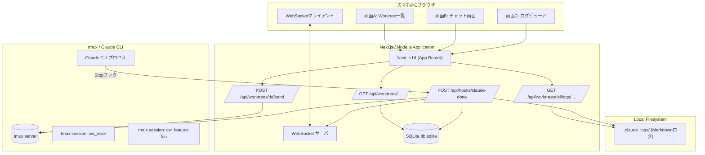
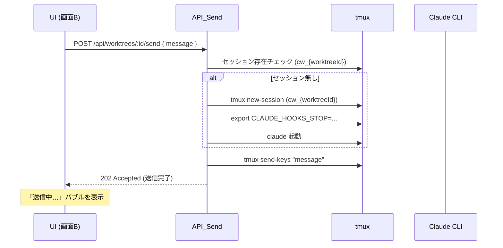
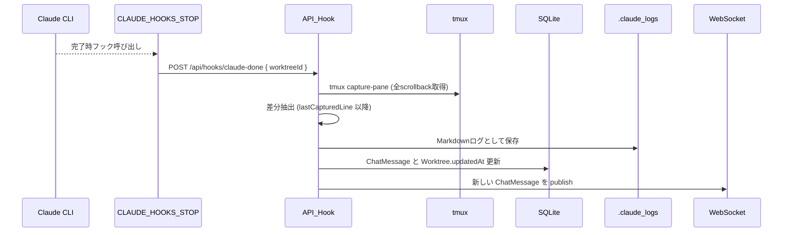

# docs/architecture.md

# myCodeBranchDesk Architecture

> git worktree ごとに Claude Code / tmux セッションを張り、スマホブラウザからチャット操作できる開発コンパニオンツールのアーキテクチャ設計書。

このドキュメントは **myCodeBranchDesk** の技術アーキテクチャを定義します。

- どのようなプロセス／コンポーネントで構成されるか
- どのように Claude CLI / tmux / Web UI が連携するか
- どのレイヤにどの責務を持たせるか

を、実装時の指針としてまとめています。

---

## 0. Scope & Notation

- 対象: `myCodeBranchDesk` アプリケーション全体
  - Next.js (App Router) ベースの Web UI
  - Node.js API / WebSocket サーバ
  - tmux + Claude CLI セッション管理
  - SQLite / ローカル FS での永続化
- 対象外:
  - Claude 側のモデル挙動
  - 他ツール（mySwiftAgent / myAgentDesk など）との具体的な統合実装

命名・用語:

- **worktree**: git worktree として管理されるブランチディレクトリ
- **worktreeId**: URL セーフな識別子（例: `feature-foo`）
- **tmux session**: `cw_{worktreeId}` という名前の tmux セッション
- **Stop フック**: Claude CLI の `CLAUDE_HOOKS_STOP` に設定する完了フック

---

## 1. System Goals

### 1.1 ゴール

- git worktree ごとに **独立した Claude CLI セッション**を管理する
- スマホや PC のブラウザから、**ブランチ別のチャット UI**として利用できる
- Stop フックを活用し、**ポーリング無しのイベント駆動**で最新の応答を反映する
- 対話の履歴／詳細ログをローカルに安全に保存する

### 1.2 Non-goals

- マルチユーザー SaaS としての動作（あくまでローカル開発者向け）
- セキュリティ境界を超えたネット越しの公開・マルチテナント運用

### 1.3 実装済み機能

- **CLI ツールのサポート** (Issue #4で実装完了)
  - Claude Code 対応
  - Strategy パターンによる拡張可能な設計

---

## 2. Context & Assumptions

### 2.1 前提環境

- 開発者のローカルマシン上で動作
  - macOS / Linux を想定（tmux / Claude CLI が利用可能）
- Claude CLI がインストール済みであり、
  - `claude` コマンドで起動できる
  - `CLAUDE_HOOKS_STOP` を設定できるバージョンである
- git worktree により、複数のブランチディレクトリが管理されている

### 2.2 実行モード

- **ローカルモード（デフォルト）**
  - `MCBD_BIND = 127.0.0.1`
  - 接続元は同一マシンのみ
- **LAN アクセスモード（任意）**
  - `MCBD_BIND = 0.0.0.0`
  - `MCBD_AUTH_TOKEN` による簡易認証を必須とする
  - 同一ネットワーク上のスマホからアクセス可能

---

## 3. High-level Architecture

### 3.1 コンポーネント図



### 3.2 プロセス & ポート
	•	Next.js / Node.js プロセス
	•	ポート: MCBD_PORT（例: 3000）
	•	バインド: MCBD_BIND（127.0.0.1 or 0.0.0.0）
	•	機能:
	•	HTTP サーバ（UI, API Routes）
	•	WebSocket サーバ
	•	SQLite への接続
	•	tmux server
	•	システム上に既存の tmux サーバを利用
	•	cw_{worktreeId} というセッション名で Claude CLI を起動
	•	Claude CLI プロセス
	•	各 tmux セッション内で claude が起動
	•	CLAUDE_HOOKS_STOP に設定されたコマンドで完了通知

⸻

## 4. Data Model

### 4.1 Worktree

```
interface Worktree {
  id: string;              // URLセーフなID ("main", "feature-foo" など)
  name: string;            // 表示名 ("main", "feature/foo" など)
  path: string;            // 絶対パス "/path/to/root/feature/foo"
  lastMessageSummary?: string; // 最後のメッセージ要約
  updatedAt?: Date;        // 最終メッセージの timestamp
}
```

- id
- URL パラメータに使用可能な形式へ正規化した識別子
- 例: feature/foo → feature-foo
- path
- MCBD_ROOT_DIR を起点とした絶対パス
- updatedAt
- Worktree 一覧を最終更新日時順に並べるために利用

### 4.2 ChatMessage

```
type ChatRole = "user" | "claude";

interface ChatMessage {
  id: string;           // UUID
  worktreeId: string;   // Worktree.id
  role: ChatRole;
  content: string;      // UI表示用の全文
  summary?: string;     // 任意の短い要約
  timestamp: Date;
  logFileName?: string; // 対応する Markdown ログファイル名
  requestId?: string;   // 将来の拡張用: 1送信=1 UUID
}
```

- content:
チャット UI にそのまま表示するテキスト（プロンプト／応答）。
- summary:
Worktree 一覧の lastMessageSummary に反映するための要約（任意）。
- logFileName:
.claude_logs/ 内の詳細ログファイルへのリンク。

### 4.3 WorktreeSessionState

```
interface WorktreeSessionState {
  worktreeId: string;
  lastCapturedLine: number; // tmux capture-pane で最後に取得した行数
}
```

- Stop フック時に tmux capture-pane で scrollback 全体を取得し、
- lastCapturedLine 以降を「今回の新規出力」として扱う差分抽出方式を前提とします。

⸻

## 5. Core Flows

### 5.1 起動 & Worktree スキャン
1. アプリ起動時、MCBD_ROOT_DIR を基準として git worktree をスキャン。
1. 取得した worktree 情報を基に Worktree レコードを DB に格納／更新。
1. 既存の cw_{worktreeId} tmux セッションがあれば、Worktree と突き合わせて整合性をとる（任意）。

### 5.2 メッセージ送信フロー（UI → Claude）

概要



詳細ステップ
1. UI（画面B）が POST /api/worktrees/:id/send に { message } を送信。
1. API:
    - worktreeId から Worktree を取得し、path を参照。
    - tmux has-session -t cw_{worktreeId} でセッション存在チェック。
    - なければ UC-2（遅延起動フロー）を実行（後述）。
1. tmux send-keys -t cw_{worktreeId} "＜message＞" C-m で Claude CLI へ送信。
1. API は 202 (Accepted) などで UI に即時応答。UI では自分のメッセージ＋「送信中…」バブルを表示。

### 5.3 Stop フック処理フロー（Claude → API → ログ/DB）



詳細ステップ
1. Claude CLI が処理完了時、CLAUDE_HOOKS_STOP に設定されたコマンドを実行。
- 例:
```
HOOK_COMMAND="curl -X POST http://localhost:3000/api/hooks/claude-done \
  -H 'Content-Type: application/json' \
  -d '{\"worktreeId\":\"{worktreeId}\"}'"
export CLAUDE_HOOKS_STOP="${HOOK_COMMAND}"
```
1. POST /api/hooks/claude-done を受け取った API_Hook は、
    - WorktreeSessionState.lastCapturedLine を読み込む（デフォルト 0）。
    - tmux capture-pane -p -S -10000 -t cw_{worktreeId} などで scrollback を取得。
1. 取得したテキストの行数をカウントし、
    - lastCapturedLine 以降の行だけを「新規出力」として抽出。
    - 将来的にマーカー (### REQUEST {id} START/END) が導入される場合は、その範囲のみ抽出する拡張も可能。
1. 抽出した差分を Markdown として .claude_logs/ 以下に保存。
1. ChatMessage のレコードを作成（role = "claude"）し、logFileName を紐付け。
1. Worktree の lastMessageSummary, updatedAt を更新。
1. 新しい ChatMessage を WebSocket 経由で publish し、該当 worktree を閲覧中のクライアントすべてに配信。

### 5.4 WebSocket フロー
- クライアントは接続時に worktreeId を指定して subscribe。
- サーバ側では worktreeId ごとに room / channel を管理。
- 新しい ChatMessage が保存されると、
- 該当 worktreeId を購読中のクライアントにブロードキャスト。

メッセージ形式の例:
```
{
  "type": "chat_message_created",
  "worktreeId": "feature-foo",
  "message": {
    "id": "uuid",
    "role": "claude",
    "content": "Claude の応答...",
    "timestamp": "2025-11-16T03:00:00.000Z",
    "logFileName": "20251116-030000-feature-foo-bd2f8c3d.md"
  }
}
```

### 5.5 エラー時 / 復旧フロー

Stop フックが届かない場合
- UI 側:
- 「送信中…」が一定時間（例: 120 秒）経過しても差し替わらない場合、警告バブルを表示。
- サーバ側:
- Hook API 側でタイムアウトログを残す（実装依存）。
- 手動で .claude_logs/ や tmux の状態を確認することを想定。

tmux セッション / Claude プロセスが落ちた場合
- API_Send 実行時に tmux has-session／プロセス状態をチェック。
- セッションが無い／Claude がいないと判定された場合は UC-2 で再起動。
- Claude CLI の再起動時にも CLAUDE_HOOKS_STOP を再セットする。

⸻

## 6. tmux & CLI Tool Integration

### 6.1 セッション命名規則
- セッション名: `mcbd-{cliToolId}-{worktreeId}`
- 例:
  - Claude: `mcbd-claude-feature-foo`
- 1 worktree に対して 1 セッションを維持する。
- ※ 旧命名規則 `cw_{worktreeId}` からの移行: Issue #4で実装

### 6.1.5 CLI Tool Abstraction Layer (Issue #4で実装)

**設計パターン:**
- Strategy パターンによるCLI tool の抽象化
- `BaseCLITool` 抽象クラスが共通インターフェースを定義:
  ```typescript
  abstract class BaseCLITool {
    abstract id: CLIToolType;
    abstract name: string;
    abstract command: string;

    abstract isInstalled(): Promise<boolean>;
    abstract isRunning(worktreeId: string): Promise<boolean>;
    abstract startSession(worktreeId: string, worktreePath: string): Promise<void>;
    abstract sendMessage(worktreeId: string, message: string): Promise<void>;
    abstract killSession(worktreeId: string): Promise<boolean>;
    getSessionName(worktreeId: string): string;
  }
  ```

**実装クラス:**
- `ClaudeTool` - Claude Code CLI

**管理:**
- `CLIToolManager` シングルトンクラスで各ツールインスタンスを管理
- ワークツリーの `cliToolId` に基づいて適切なツールを取得

**利点:**
- 新しいCLI toolの追加が容易（`BaseCLITool`を継承するだけ）
- API層は抽象インターフェースのみに依存、具体的な実装に依存しない
- 各ツール固有のロジックをカプセル化

### 6.2 UC-2: 遅延セッション起動フロー

```
# {sessionName}   = cw_{worktreeId}
# {worktreePath}  = /path/to/root/feature/foo
tmux new-session -d -s "{sessionName}" -c "{worktreePath}"

HOOK_COMMAND="curl -X POST http://localhost:3000/api/hooks/claude-done \
  -H 'Content-Type: application/json' \
  -d '{\"worktreeId\":\"{worktreeId}\"}'"

tmux send-keys -t "{sessionName}" "export CLAUDE_HOOKS_STOP='${HOOK_COMMAND}'" C-m
tmux send-keys -t "{sessionName}" "claude" C-m
```
- API から直接 tmux コマンドを叩くラッパーは src/lib/tmux.ts にまとめる。

### 6.3 死活監視（任意強度）
- シンプルな実装では「セッションの存在」のみチェック。
- より堅牢にする場合:
- tmux list-panes -F "#{pane_pid}" → ps で該当 PID が claude か確認。
- プロンプト状態（claude が終了）になっていた場合、CLAUDE_HOOKS_STOP 再設定 + claude 再起動。

⸻

## 7. Persistence

### 7.1 SQLite (db.sqlite)
- 保存場所の例: ~/.mycodebranchdesk/db.sqlite
- テーブル（イメージ）:
- worktrees:
- id, name, path, last_message_summary, updated_at
- **cli_tool_id** (追加: Issue #4) - 使用するCLI tool ('claude' | 'codex' | 'gemini')
- repository_path, repository_name, description
- last_user_message, last_user_message_at
- favorite, status, link
- chat_messages:
- id, worktree_id, role, content, summary, timestamp, log_file_name, request_id
- message_type, prompt_data
- session_states:
- worktree_id, last_captured_line

### 7.2 Markdown Logs (.claude_logs/)
- 各 worktree ディレクトリ直下に .claude_logs/ ディレクトリを作成。
- ファイル命名規則:

{YYYYMMDD}-{HHmmss}-{worktreeId}-{uuid}.md


- 中身イメージ:
```
# myCodeBranchDesk Log

## Worktree
feature/foo

## Timestamp
2025-11-16T03:00:00Z

## User

<ユーザーのプロンプト>

## Claude

<Claudeの応答全文>
```

- 削除ポリシー:
- v1 では自動削除は行わず、将来 CLI などでのクリーンアップを検討。

⸻

## 8. Configuration

### 8.1 環境変数一覧（予定）
- MCBD_ROOT_DIR (必須)
- git worktree 管理のルートディレクトリ
- MCBD_PORT (任意, デフォルト: 3000)
- MCBD_BIND (任意, デフォルト: 127.0.0.1)
- MCBD_AUTH_TOKEN (任意だが MCBD_BIND=0.0.0.0 の場合は必須)
- 将来的に追加される可能性のあるもの:
- MCBD_DB_PATH（db.sqlite の保存先）
- MCBD_LOG_LEVEL（ログ出力レベル）

.env.example としてリポジトリに同梱することを想定。

⸻

## 9. Security Model

### 9.1 ローカルモード
- デフォルトは MCBD_BIND=127.0.0.1
- 同一マシンからのアクセスに限定。
- セキュリティリスクはほぼ OS ユーザーに依存。

### 9.2 LAN アクセスモード
- MCBD_BIND=0.0.0.0 の場合、同一 LAN 上の任意端末からのアクセスが可能になるため、以下を必須とする:
- MCBD_AUTH_TOKEN を設定
- すべての HTTP / WebSocket 接続に対し、Authorization: Bearer <token> で認証を行う
- HTTPS / TLS 終端については、当面は前段のリバースプロキシ（Caddy / nginx 等）に委譲する。

⸻

## 10. Extensibility & Future Work

### 10.1 Stop フック拡張
- 将来的に、Stop フックの payload に requestId も含める設計余地を残す:

```
-d '{\"worktreeId\":\"{worktreeId}\", \"requestId\":\"{requestId}\"}'
```

- ChatMessage.requestId とログ名に埋め込むことで、「どのリクエストの応答か」をより厳密にトレース可能。

### 10.2 マルチ LLM / マルチセッション ✅ 実装済み (Issue #4)

**実装内容:**
- Claude Code に対応
- ワークツリーごとに `cliToolId` フィールドで使用するCLIツールを管理
- Strategy パターンによる抽象化:
  - `BaseCLITool` 抽象クラス
  - `ClaudeTool` 実装クラス
  - `CLIToolManager` シングルトンでツールインスタンスを管理
- データベーススキーマ: `worktrees.cli_tool_id` カラム（デフォルト: 'claude'）
- 対応API:
  - `POST /api/worktrees/:id/send` - メッセージ送信
  - `POST /api/worktrees/:id/respond` - プロンプト応答
  - `POST /api/worktrees/:id/kill-session` - セッション終了
  - `GET /api/worktrees` - ワークツリー一覧（セッション状態含む）

**将来拡張:**
- その他のCLI（openai, lmstudio等）を追加する場合は、`BaseCLITool`を継承して実装
- Stop フックの仕様が異なる場合は各ツールクラス内で対応

### 10.3 リアルタイムステータス検出 ✅ 実装済み (Issue #31)

**実装内容:**
- ターミナル出力を直接解析してCLIツールの状態をリアルタイム検出
- サイドバーに視覚的なステータスインジケーターを表示
- 2秒間隔でポーリング更新

**ステータス種別:**
| ステータス | 表示 | 検出条件 |
|-----------|------|----------|
| `idle` | グレー● | セッション未起動 |
| `ready` | 緑● | 入力プロンプト `❯` 表示中 |
| `running` | 青スピナー | 思考インジケータ検出 |
| `waiting` | 黄● | インタラクティブプロンプト検出 |

**検出ロジック:**
1. `captureSessionOutput()` でターミナル出力を取得
2. ANSIエスケープコードを除去
3. 空行をフィルタリングして最後15行を抽出
4. 優先順位に従ってパターンマッチング:
   - インタラクティブプロンプト → `waiting`
   - 思考インジケータ (`✻ Thinking…`) → `running`
   - 入力プロンプト (`❯`) → `ready`
   - それ以外 → `running` (処理中と推定)

**関連ファイル:**
- `src/config/status-colors.ts` - ステータス色の一元管理
- `src/lib/cli-patterns.ts` - CLIツール別パターン定義
- `src/lib/prompt-detector.ts` - プロンプト検出
- `src/types/sidebar.ts` - ステータス判定ロジック

詳細は [ステータスインジケーター](./features/sidebar-status-indicator.md) を参照。

### 10.4 リポジトリ削除機能 ✅ 実装済み (Issue #69)

**実装内容:**
- 登録済みリポジトリを削除するAPIエンドポイントとUI
- 関連するworktree、セッション、ポーリングを一括クリーンアップ
- Facadeパターンによるセッション停止処理の一元化

**対応API:**
- `DELETE /api/repositories` - リポジトリ削除（リクエストボディで `repositoryPath` を指定）

**リクエスト/レスポンス:**
```json
// Request
{ "repositoryPath": "/path/to/repository" }

// Response (200 OK)
{
  "success": true,
  "deletedWorktreeCount": 3,
  "warnings": []
}
```

**エラーレスポンス:**
| ステータス | 条件 |
|-----------|------|
| 400 | `repositoryPath` 未指定 |
| 404 | リポジトリが存在しない |

**削除処理フロー:**
1. リポジトリに属する全worktree IDを取得
2. 各worktreeのtmuxセッションをkill（失敗してもwarningsに記録して続行）
3. response-poller / claude-pollerを停止
4. WebSocket購読状態をクリーンアップ
5. DBからworktreeレコードをCASCADE削除
6. `repository_deleted` イベントをbroadcast

**段階的エラーハンドリング:**
- セッションkill失敗時もDB削除は継続
- 失敗情報は `warnings` 配列で返却

**UI実装:**
- リポジトリフィルターチップにホバー時削除ボタン（×）表示
- 確認ダイアログで「delete」入力必須
- `WORKTREE_REPOS` 環境変数設定リポジトリに警告アイコン（⚠️）表示

**関連ファイル:**
- `src/lib/session-cleanup.ts` - セッション/ポーラー停止のFacade
- `src/app/api/repositories/route.ts` - DELETEエンドポイント
- `src/lib/db.ts` - `getWorktreeIdsByRepository()`, `deleteRepositoryWorktrees()`
- `src/lib/ws-server.ts` - `cleanupRooms()`
- `src/components/worktree/WorktreeList.tsx` - 削除UI

### 10.5 Observability
- 将来的に:
- 応答時間（latency）の計測
- エラー率
- セッションごとの履歴メトリクス
- などを可視化するため、ChatMessage や Worktree にメタ情報フィールドを拡張する余地を残す。

⸻