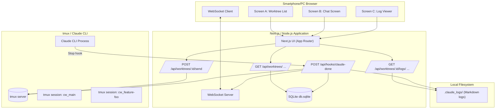
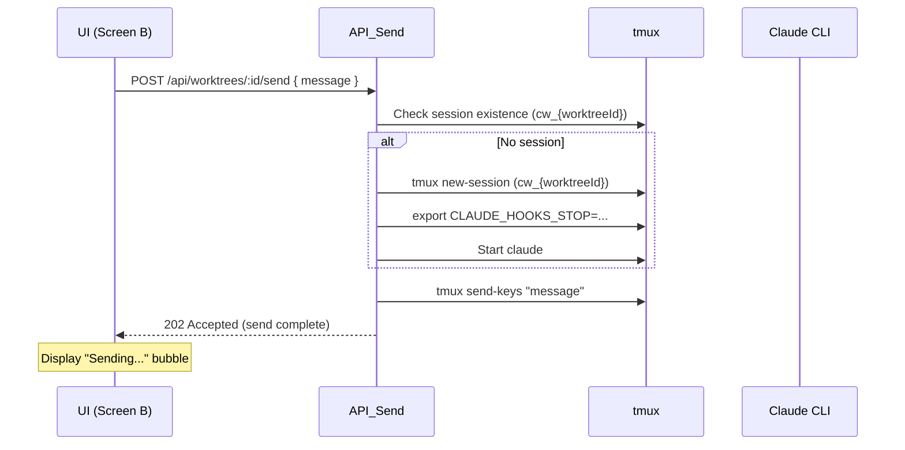
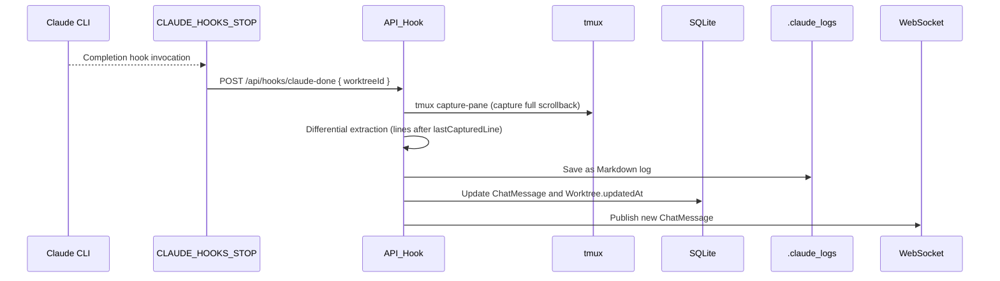

[日本語版](../architecture.md)

# CommandMate Architecture

> Architecture design document for a development companion tool that opens Claude Code / tmux sessions per git worktree and allows chat operations from a smartphone browser.

This document defines the technical architecture of **CommandMate**.

- What processes/components make up the system
- How Claude CLI / tmux / Web UI cooperate
- Which responsibilities belong to which layer

It serves as a guide during implementation.

---

## 0. Scope & Notation

- Scope: The entire `CommandMate` application
  - Next.js (App Router) based Web UI
  - Node.js API / WebSocket server
  - tmux + Claude CLI session management
  - SQLite / local FS persistence
- Out of scope:
  - Claude model behavior
  - Specific integration implementations with other tools (mySwiftAgent / myAgentDesk, etc.)

Naming / Terminology:

- **worktree**: A branch directory managed as a git worktree
- **worktreeId**: A URL-safe identifier (e.g., `feature-foo`)
- **tmux session**: A tmux session named `cw_{worktreeId}`
- **Stop hook**: A completion hook set via Claude CLI's `CLAUDE_HOOKS_STOP`

---

## 1. System Goals

### 1.1 Goals

- Manage **independent Claude CLI sessions** per git worktree
- Provide a **per-branch chat UI** accessible from smartphone or PC browsers
- Use Stop hooks for **event-driven updates** without polling for the latest responses
- Safely store conversation history / detailed logs locally

### 1.2 Non-goals

- Operating as a multi-user SaaS (this is for local developers)
- Public exposure across security boundaries / multi-tenant operation

### 1.3 Implemented Features

- **CLI Tool Support** (Implemented in Issue #4, extended in Issue #368)
  - Claude Code, Codex CLI, Gemini CLI, Vibe-Local (Ollama) support
  - Extensible design via Strategy pattern
  - Select 2 agents per worktree (`selected_agents` column)
  - Vibe-Local supports Ollama model selection (`vibe_local_model` column)

---

## 2. Context & Assumptions

### 2.1 Prerequisites

- Runs on the developer's local machine
  - macOS / Linux assumed (tmux / Claude CLI must be available)
- Claude CLI is installed and:
  - Can be launched with the `claude` command
  - Supports setting `CLAUDE_HOOKS_STOP`
- Multiple branch directories are managed via git worktree

### 2.2 Execution Modes

- **Local mode (default)**
  - `MCBD_BIND = 127.0.0.1`
  - Connections from the same machine only
- **LAN access mode (optional)**
  - `CM_BIND = 0.0.0.0`
  - Reverse proxy authentication recommended (details: `docs/security-guide.md`)
  - Accessible from smartphones on the same network

---

## 3. High-level Architecture

### 3.1 Component Diagram



### 3.2 Processes & Ports

- **Next.js / Node.js process**
  - Port: MCBD_PORT (e.g., 3000)
  - Bind: MCBD_BIND (127.0.0.1 or 0.0.0.0)
  - Features:
    - HTTP server (UI, API Routes)
    - WebSocket server
    - SQLite connection
- **tmux server**
  - Uses the existing tmux server on the system
  - Launches CLI tools in sessions named `cw_{worktreeId}`
- **CLI tool process (Claude Code / Codex CLI)**
  - The selected CLI tool runs within each tmux session
  - Sends completion notifications via the command set in `CLAUDE_HOOKS_STOP` (for Claude Code)

---

## 4. Data Model

### 4.1 Worktree

```typescript
interface Worktree {
  id: string;              // URL-safe ID ("main", "feature-foo", etc.)
  name: string;            // Display name ("main", "feature/foo", etc.)
  path: string;            // Absolute path "/path/to/root/feature/foo"
  lastMessageSummary?: string; // Summary of the last message
  updatedAt?: Date;        // Timestamp of last message
}
```

- **id**: Identifier normalized to a URL-parameter-safe format
  - Example: `feature/foo` → `feature-foo`
- **path**: Absolute path based on `MCBD_ROOT_DIR`
- **updatedAt**: Used for sorting the worktree list by last update time

### 4.2 ChatMessage

```typescript
type ChatRole = "user" | "claude";

interface ChatMessage {
  id: string;           // UUID
  worktreeId: string;   // Worktree.id
  role: ChatRole;
  content: string;      // Full text for UI display
  summary?: string;     // Optional short summary
  timestamp: Date;
  logFileName?: string; // Corresponding Markdown log file name
  requestId?: string;   // Future extension: 1 send = 1 UUID
}
```

- **content**: Text displayed directly in the chat UI (prompt/response).
- **summary**: Summary for `Worktree.lastMessageSummary` (optional).
- **logFileName**: Link to the detailed log file in `.claude_logs/`.

### 4.3 WorktreeSessionState

```typescript
interface WorktreeSessionState {
  worktreeId: string;
  lastCapturedLine: number; // Last line count obtained via tmux capture-pane
}
```

- On Stop hook, the entire scrollback is captured via `tmux capture-pane`.
- Lines after `lastCapturedLine` are treated as "new output" for differential extraction.

---

## 5. Core Flows

### 5.1 Startup & Worktree Scan

1. On app startup, scan git worktrees based on `MCBD_ROOT_DIR`.
2. Store/update Worktree records in the DB based on the scanned worktree information.
3. If existing `cw_{worktreeId}` tmux sessions exist, reconcile them with Worktrees (optional).

### 5.2 Message Send Flow (UI → Claude)

**Overview**



**Detailed Steps**

1. UI (Screen B) sends `POST /api/worktrees/:id/send` with `{ message }`.
2. API:
   - Retrieves the Worktree from worktreeId and references the path.
   - Checks session existence with `tmux has-session -t cw_{worktreeId}`.
   - If not found, executes UC-2 (lazy startup flow, described below).
3. Sends the message to Claude CLI with `tmux send-keys -t cw_{worktreeId} "<message>" C-m`.
4. API responds immediately with 202 (Accepted). The UI displays the user's message plus a "Sending..." bubble.

### 5.3 Stop Hook Processing Flow (Claude → API → Logs/DB)



**Detailed Steps**

1. When Claude CLI completes processing, it executes the command set in `CLAUDE_HOOKS_STOP`.
   - Example:
   ```
   HOOK_COMMAND="curl -X POST http://localhost:3000/api/hooks/claude-done \
     -H 'Content-Type: application/json' \
     -d '{\"worktreeId\":\"{worktreeId}\"}'"
   export CLAUDE_HOOKS_STOP="${HOOK_COMMAND}"
   ```
2. `API_Hook` receives `POST /api/hooks/claude-done`:
   - Reads `WorktreeSessionState.lastCapturedLine` (default 0).
   - Captures scrollback with `tmux capture-pane -p -S -10000 -t cw_{worktreeId}`.
3. Counts lines in the captured text:
   - Extracts only lines after `lastCapturedLine` as "new output".
   - Future extension: If markers (`### REQUEST {id} START/END`) are introduced, only that range can be extracted.
4. Saves the extracted diff as Markdown under `.claude_logs/`.
5. Creates a `ChatMessage` record (`role = "claude"`) with the linked `logFileName`.
6. Updates `Worktree.lastMessageSummary` and `updatedAt`.
7. Publishes the new `ChatMessage` via WebSocket to all clients viewing the relevant worktree.

### 5.4 WebSocket Flow

- Clients subscribe by specifying a `worktreeId` upon connection.
- The server manages rooms/channels per `worktreeId`.
- When a new `ChatMessage` is saved, it broadcasts to all clients subscribed to that `worktreeId`.

Message format example:
```json
{
  "type": "chat_message_created",
  "worktreeId": "feature-foo",
  "message": {
    "id": "uuid",
    "role": "claude",
    "content": "Claude's response...",
    "timestamp": "2025-11-16T03:00:00.000Z",
    "logFileName": "20251116-030000-feature-foo-bd2f8c3d.md"
  }
}
```

### 5.5 Error / Recovery Flow

**When Stop hook doesn't arrive**

- UI side:
  - If "Sending..." isn't replaced after a set period (e.g., 120 seconds), display a warning bubble.
- Server side:
  - Log a timeout in the Hook API (implementation-dependent).
  - Manual checking of `.claude_logs/` or tmux state is expected.

**When tmux session / Claude process crashes**

- During `API_Send`, check tmux session / process state with `tmux has-session`.
- If no session / Claude not found, restart via UC-2.
- Re-set `CLAUDE_HOOKS_STOP` when restarting Claude CLI.

---

## 6. tmux & CLI Tool Integration

### 6.1 Session Naming Convention

- Session name: `mcbd-{cliToolId}-{worktreeId}`
- Example:
  - Claude: `mcbd-claude-feature-foo`
- One session per worktree is maintained.
- Note: Migration from old naming convention `cw_{worktreeId}`: Implemented in Issue #4

### 6.1.5 CLI Tool Abstraction Layer (Implemented in Issue #4)

**Design Pattern:**
- CLI tool abstraction via Strategy pattern
- `BaseCLITool` abstract class defines the common interface:
  ```typescript
  abstract class BaseCLITool {
    abstract id: CLIToolType;
    abstract name: string;
    abstract command: string;

    abstract isInstalled(): Promise<boolean>;
    abstract isRunning(worktreeId: string): Promise<boolean>;
    abstract startSession(worktreeId: string, worktreePath: string): Promise<void>;
    abstract sendMessage(worktreeId: string, message: string): Promise<void>;
    abstract killSession(worktreeId: string): Promise<boolean>;
    getSessionName(worktreeId: string): string;
  }
  ```

**Implementation Classes:**
- `ClaudeTool` - Claude Code CLI
- `CodexTool` - Codex CLI
- `GeminiTool` - Gemini CLI (Issue #368)
- `VibeLocalTool` - Vibe-Local / Ollama (Issue #368)

**Management:**
- `CLIToolManager` singleton class manages each tool instance
- Retrieves the appropriate tool based on the worktree's `cliToolId`

**Benefits:**
- Easy to add new CLI tools (just extend `BaseCLITool`)
- API layer depends only on abstract interfaces, not specific implementations
- Encapsulates tool-specific logic

### 6.2 UC-2: Lazy Session Startup Flow

```bash
# {sessionName}   = cw_{worktreeId}
# {worktreePath}  = /path/to/root/feature/foo
tmux new-session -d -s "{sessionName}" -c "{worktreePath}"

HOOK_COMMAND="curl -X POST http://localhost:3000/api/hooks/claude-done \
  -H 'Content-Type: application/json' \
  -d '{\"worktreeId\":\"{worktreeId}\"}'"

tmux send-keys -t "{sessionName}" "export CLAUDE_HOOKS_STOP='${HOOK_COMMAND}'" C-m
tmux send-keys -t "{sessionName}" "claude" C-m
```

- The wrapper for executing tmux commands directly from the API is organized in `src/lib/tmux.ts`.

### 6.3 Health Monitoring (Variable Intensity)

- Simple implementation: Only check "session existence".
- For more robustness:
  - `tmux list-panes -F "#{pane_pid}"` → Use `ps` to verify the PID is `claude`.
  - If in prompt state (claude has exited), re-set `CLAUDE_HOOKS_STOP` + restart claude.

---

## 7. Persistence

### 7.1 SQLite (db.sqlite)

- Storage location example: `~/.mycodebranchdesk/db.sqlite`
- Tables (conceptual):
  - **worktrees**:
    - id, name, path, last_message_summary, updated_at
    - **cli_tool_id** (added: Issue #4) - CLI tool to use ('claude' | 'codex' | 'gemini' | 'vibe-local')
    - **selected_agents** (added: Issue #368) - Selected 2 agents (JSON array, e.g., '["claude","vibe-local"]')
    - **vibe_local_model** (added: Issue #368) - Ollama model name for Vibe-Local (nullable)
    - repository_path, repository_name, description
    - last_user_message, last_user_message_at
    - favorite, status, link
  - **chat_messages**:
    - id, worktree_id, role, content, summary, timestamp, log_file_name, request_id
    - message_type, prompt_data
  - **session_states**:
    - worktree_id, last_captured_line

### 7.2 Markdown Logs (.claude_logs/)

- A `.claude_logs/` directory is created directly under each worktree directory.
- File naming convention:

  `{YYYYMMDD}-{HHmmss}-{worktreeId}-{uuid}.md`

- Content example:
```markdown
# CommandMate Log

## Worktree
feature/foo

## Timestamp
2025-11-16T03:00:00Z

## User

<User's prompt>

## Claude

<Claude's full response>
```

- Deletion policy:
  - v1 does not perform automatic deletion; future cleanup via CLI is under consideration.

---

## 8. Configuration

### 8.1 Environment Variables (Planned)

- `MCBD_ROOT_DIR` (required)
  - Root directory for git worktree management
- `MCBD_PORT` (optional, default: 3000)
- `MCBD_BIND` (optional, default: 127.0.0.1)
- Potentially added in the future:
  - `MCBD_DB_PATH` (storage location for db.sqlite)
  - `MCBD_LOG_LEVEL` (log output level)

A `.env.example` file is expected to be included in the repository.

---

## 9. Security Model

### 9.1 Local Mode

- Default is `MCBD_BIND=127.0.0.1`
- Access is limited to the same machine.
- Security risk is essentially dependent on the OS user.

### 9.2 LAN Access Mode

- When `CM_BIND=0.0.0.0`, access from any device on the same LAN is possible
- Reverse proxy authentication (Nginx / Caddy, etc.) is recommended (details: `docs/security-guide.md`)
- HTTPS / TLS termination is delegated to the reverse proxy

---

## 10. Extensibility & Future Work

### 10.1 Stop Hook Extension

- Future design allows including `requestId` in the Stop hook payload:

```json
{ "worktreeId": "{worktreeId}", "requestId": "{requestId}" }
```

- By embedding it in `ChatMessage.requestId` and log names, you can more precisely trace "which request this response belongs to."

### 10.2 Multi-LLM / Multi-Session ✅ Implemented (Issue #4)

**Implementation:**
- Claude Code support
- Each worktree manages its CLI tool via the `cliToolId` field
- Abstraction via Strategy pattern:
  - `BaseCLITool` abstract class
  - `ClaudeTool` implementation class
  - `CLIToolManager` singleton for managing tool instances
- Database schema: `worktrees.cli_tool_id` column (default: 'claude')
- Supported APIs:
  - `POST /api/worktrees/:id/send` - Send message
  - `POST /api/worktrees/:id/respond` - Respond to prompt
  - `POST /api/worktrees/:id/kill-session` - Kill session
  - `GET /api/worktrees` - List worktrees (including session state)

**Future Extensions:**
- To add other CLIs (openai, lmstudio, etc.), implement by extending `BaseCLITool`
- If Stop hook specifications differ, handle within each tool class

### 10.3 Real-Time Status Detection ✅ Implemented (Issue #31)

**Implementation:**
- Real-time detection of CLI tool state by directly parsing terminal output
- Visual status indicators displayed in the sidebar
- Polling updates every 2 seconds

**Status Types:**

| Status | Display | Detection Condition |
|--------|---------|---------------------|
| `idle` | Gray ● | Session not started |
| `ready` | Green ● | Input prompt `❯` displayed |
| `running` | Blue spinner | Thinking indicator detected |
| `waiting` | Yellow ● | Interactive prompt detected |

**Detection Logic:**
1. Capture terminal output via `captureSessionOutput()`
2. Strip ANSI escape codes
3. Filter empty lines and extract the last 15 lines
4. Pattern match in priority order:
   - Interactive prompt → `waiting`
   - Thinking indicator (`✻ Thinking…`) → `running`
   - Input prompt (`❯`) → `ready`
   - Otherwise → `running` (assumed processing)

**Related Files:**
- `src/config/status-colors.ts` - Centralized status color management
- `src/lib/cli-patterns.ts` - CLI tool-specific pattern definitions
- `src/lib/prompt-detector.ts` - Prompt detection
- `src/types/sidebar.ts` - Status determination logic

For details, see [Status Indicator](./features/sidebar-status-indicator.md).

### 10.4 Repository Deletion ✅ Implemented (Issue #69)

**Implementation:**
- API endpoint and UI for deleting registered repositories
- Batch cleanup of related worktrees, sessions, and pollers
- Centralized session stop processing via Facade pattern

**API:**
- `DELETE /api/repositories` - Delete repository (specify `repositoryPath` in request body)

**Request/Response:**
```json
// Request
{ "repositoryPath": "/path/to/repository" }

// Response (200 OK)
{
  "success": true,
  "deletedWorktreeCount": 3,
  "warnings": []
}
```

**Error Responses:**

| Status | Condition |
|--------|-----------|
| 400 | `repositoryPath` not specified |
| 404 | Repository does not exist |

**Deletion Flow:**
1. Get all worktree IDs belonging to the repository
2. Kill tmux sessions for each worktree (if kill fails, record in warnings and continue)
3. Stop response-pollers
4. Clean up WebSocket subscription state
5. CASCADE delete worktree records from DB
6. Broadcast `repository_deleted` event

**Gradual Error Handling:**
- DB deletion continues even when session kill fails
- Failure information is returned in the `warnings` array

**UI Implementation:**
- Delete button (×) appears on hover over repository filter chips
- Confirmation dialog requires typing "delete"
- Warning icon (⚠️) displayed for repositories set via `WORKTREE_REPOS` environment variable

**Related Files:**
- `src/lib/session-cleanup.ts` - Session/poller stop Facade
- `src/app/api/repositories/route.ts` - DELETE endpoint
- `src/lib/db.ts` - `getWorktreeIdsByRepository()`, `deleteRepositoryWorktrees()`
- `src/lib/ws-server.ts` - `cleanupRooms()`
- `src/components/worktree/WorktreeList.tsx` - Delete UI

### 10.5 Observability

- For the future:
  - Response time (latency) measurement
  - Error rates
  - Per-session history metrics
  - Extension fields in ChatMessage and Worktree for metadata to enable visualization.
