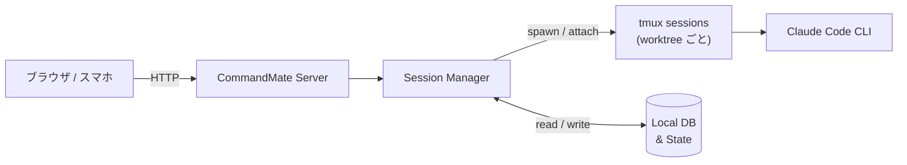
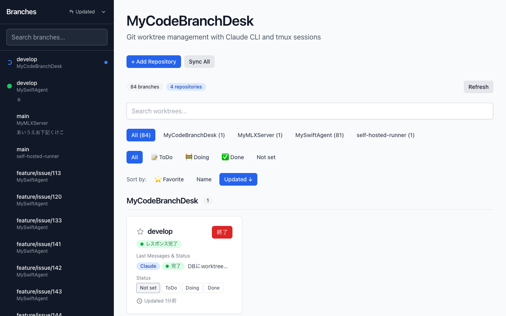
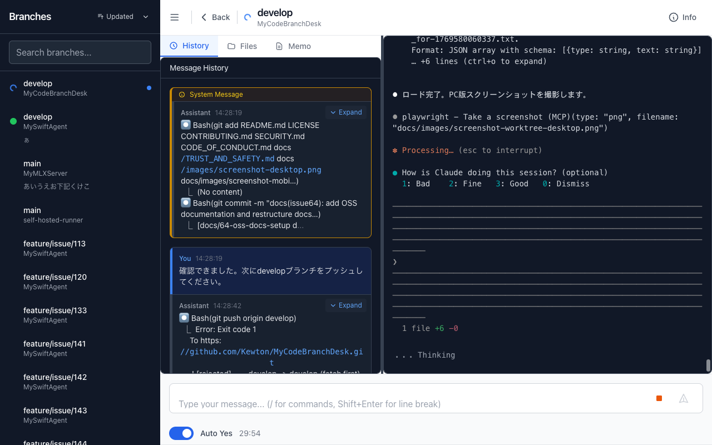
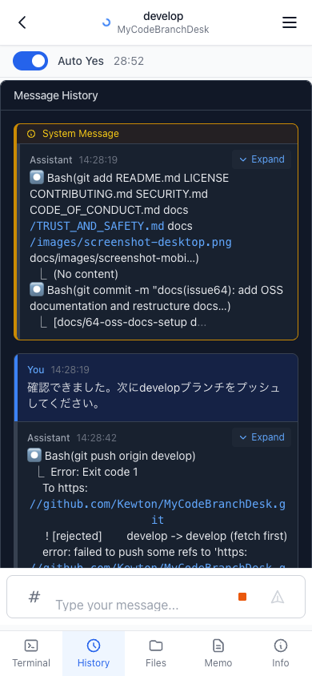
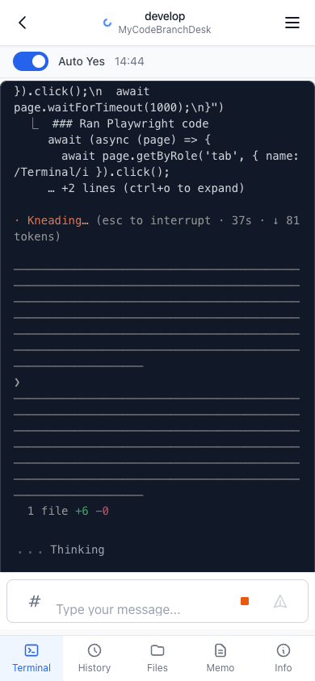
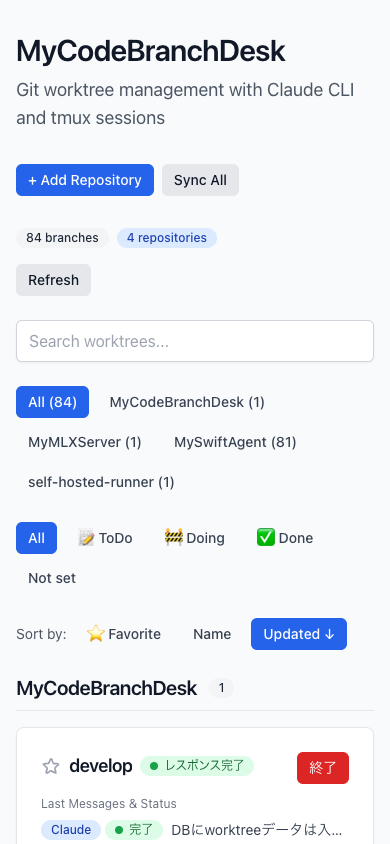

# CommandMate


**Status: Beta**

[English](../../README.md) | [日本語](./README.md)

<p align="center">
  
</p>

> **PC を閉じても Claude Code は止まらない。スマホから確認して、方向を決める。**

「リモコン」ではなく、**モバイル開発コックピット**。

CommandMate は Claude Code・Codex CLI のセッションを Git worktree 単位で管理し、スマホを含むあらゆるブラウザから操作できる Web UI を提供します。Auto Yes モードでエージェントが自律的に動き続ける間、あなたはスマホから進捗を監視し、コード変更を確認し、指示を編集し、スクリーンショットで方向を伝えられます。

もちろんデスクトップでも快適に使えます。2カラムレイアウトで全セッション・全ワークツリーを一望できます。

<p align="center">
  
</p>

```bash
npx commandmate
```

---

## 6本柱の機能

| 柱 | 機能 | なぜ重要か |
|----|------|-----------|
| **Auto Yes モード** | 確認なしでエージェントが動き続ける | 放置しても Claude Code が止まらない |
| **Git Worktree セッション** | worktree ごとに独立したセッション、並列実行 | 複数タスクが同時に進む |
| **モバイル Web UI** | あらゆるブラウザからセッションを操作 | スマホから監視・指示が可能 |
| **ファイルビューワ** | ブラウザからワークツリー内のファイルを閲覧 | PC を開かずにコード変更を確認 |
| **Markdown エディタ** | ブラウザから Markdown ファイルを編集 | 外出先から AI への指示を更新 |
| **スクリーンショット指示** | プロンプトに画像を添付 | バグ画面を撮影 →「これ直して」— エージェントが画像を認識 |

---

## Quick Start

**前提条件：** macOS / Linux、Node.js v20+、npm、git、tmux、openssl

```bash
# インストール & 起動をワンコマンドで
npx commandmate

# またはグローバルインストール
npm install -g commandmate
commandmate init
commandmate start --daemon
```

ブラウザで http://localhost:3000 にアクセスしてください。

詳しくは [CLI セットアップガイド](../user-guide/cli-setup-guide.md) を参照してください。

---

## 競合比較

| 機能 | CommandMate | Happy Coder | claude-squad | Omnara |
|------|:-----------:|:-----------:|:------------:|:------:|
| Auto Yes モード | あり | なし | あり（TUI のみ） | なし |
| Git Worktree 管理 | あり | なし | あり（TUI のみ） | なし |
| モバイル Web UI | あり | あり | **なし** | あり |
| ファイルビューワ | あり | なし | なし | なし |
| Markdown エディタ | あり | なし | なし | なし |
| スクリーンショット指示 | あり | なし | 不可能 | なし |
| 無料 / OSS | あり | 無料+有料 | あり | $20/月 |
| 完全ローカル実行 | あり | サーバー経由 | あり | クラウドフォールバック |

---

## ワークフロー

```
1. PC でタスクを開始
   $ commandmate start --daemon
   → Claude Code が Auto Yes で自律稼働開始

2. PC を閉じて外出

3. スマホから Web UI で確認
   → 全セッションの状態を一目で把握

4. コード変更をレビュー
   → ファイルビューワでモバイルから差分を確認

5. 方向を修正
   → Markdown の指示ファイルを編集、または新しいプロンプトを入力

6. バグを発見
   → スクリーンショット指示: 画面を撮影して「これ直して」

7. Claude Code が画像を認識して修正開始
```

---

## セキュリティ

**100% ローカル実行**。外部サーバーなし、クラウド中継なし、アカウント登録不要。ネットワーク通信は Claude CLI 自体の API 呼び出しのみ。

- フルオープンソース（[MIT License](../../LICENSE)）
- ローカルデータベース、ローカルセッション
- リモートアクセスは VPN または認証付きリバースプロキシを推奨

詳細は[セキュリティガイド](../security-guide.md)と [Trust & Safety](../TRUST_AND_SAFETY.md) を参照してください。

---

## 仕組み



Git worktree ごとに専用の tmux セッションが割り当てられるため、複数タスクを干渉なく並列実行できます。

---

<details>
<summary><strong>CLI コマンド</strong></summary>

### 基本

| コマンド | 説明 |
|---------|------|
| `commandmate init` | 初期設定（対話形式） |
| `commandmate init --defaults` | 初期設定（デフォルト値） |
| `commandmate init --force` | 既存設定を上書き |
| `commandmate start` | サーバー起動（フォアグラウンド） |
| `commandmate start --daemon` | バックグラウンド起動 |
| `commandmate start --dev` | 開発モードで起動 |
| `commandmate start -p 3001` | ポート指定で起動 |
| `commandmate stop` | サーバー停止 |
| `commandmate stop --force` | 強制停止（SIGKILL） |
| `commandmate status` | 状態確認 |

### Worktree 並列開発

Issue/worktree ごとにサーバーを分離起動し、自動ポート割当で並列開発が可能です。

| コマンド | 説明 |
|---------|------|
| `commandmate start --issue 123` | Issue #123 用サーバー起動 |
| `commandmate start --issue 123 --auto-port` | 自動ポート割当で起動 |
| `commandmate start --issue 123 -p 3123` | 特定ポートで起動 |
| `commandmate stop --issue 123` | Issue #123 用サーバー停止 |
| `commandmate status --issue 123` | Issue #123 用サーバー状態確認 |
| `commandmate status --all` | 全サーバー状態確認 |

### GitHub Issue 管理

[gh CLI](https://cli.github.com/) のインストールが必要です。

| コマンド | 説明 |
|---------|------|
| `commandmate issue create` | Issue を作成 |
| `commandmate issue create --bug` | バグ報告テンプレートで作成 |
| `commandmate issue create --feature` | 機能リクエストテンプレートで作成 |
| `commandmate issue create --question` | 質問テンプレートで作成 |
| `commandmate issue create --title <title>` | タイトルを指定 |
| `commandmate issue create --body <body>` | 本文を指定 |
| `commandmate issue create --labels <labels>` | ラベルを追加（カンマ区切り） |
| `commandmate issue search <query>` | Issue を検索 |
| `commandmate issue list` | Issue 一覧 |

### ドキュメント参照

| コマンド | 説明 |
|---------|------|
| `commandmate docs` | ドキュメント表示 |
| `commandmate docs -s <section>` | 特定セクションを表示 |
| `commandmate docs -q <query>` | ドキュメント検索 |
| `commandmate docs --all` | 全セクション一覧 |

全オプションは `commandmate --help` で確認できます。

</details>

<details>
<summary><strong>スクリーンショット</strong></summary>

### デスクトップ



### ワークツリー詳細画面（Message / Console / History）

| PC表示 | スマホ（History） | スマホ（Terminal） |
|--------|-------------------|-------------------|
|  |  |  |

### トップ画面（スマホ）



</details>

<details>
<summary><strong>トラブルシューティング & FAQ</strong></summary>

### Claude CLI が見つからない / パスが変わった？

Claude CLI の npm 版とスタンドアロン版を切り替えるとパスが変わることがあります。CommandMate は次のセッション起動時に自動検出します。カスタムパスを設定するには `.env` に `CLAUDE_PATH=/path/to/claude` を追加してください。

### ポート競合？

```bash
commandmate start -p 3001
```

### セッションが固まっている / 応答がない？

tmux セッションを直接確認できます。CommandMate は `mcbd-{ツール名}-{worktree名}` の形式でセッションを管理しています：

```bash
# CommandMate が管理しているセッション一覧を確認
tmux list-sessions | grep mcbd

# 特定セッションの出力を確認（アタッチせずに）
tmux capture-pane -t "mcbd-claude-feature-123" -p

# セッションにアタッチして確認（detach は Ctrl+b → d）
tmux attach -t "mcbd-claude-feature-123"

# 壊れたセッションを手動で削除
tmux kill-session -t "mcbd-claude-feature-123"
```

> **注意：** アタッチ中にセッション内で直接入力すると、CommandMate のセッション管理と干渉する可能性があります。`Ctrl+b` → `d` で detach し、CommandMate UI から操作してください。

### Claude Code 内から起動するとセッション開始に失敗する？

Claude Code は `CLAUDECODE=1` を設定してネストを防止しています。CommandMate は自動で除去しますが、問題が続く場合は `tmux set-environment -g -u CLAUDECODE` を実行してください。

### FAQ

**Q: スマホからどうやってアクセスする？**
A: CommandMate は PC 上で Web サーバーを起動します。スマホと PC が同じネットワーク（Wi-Fi）にいる状態で、`commandmate init` で外部アクセスを有効にすると `CM_BIND=0.0.0.0` が設定されます。スマホのブラウザで `http://<PCのIPアドレス>:3000` を開いてください。

**Q: 外出先からアクセスできる？**
A: はい。[Cloudflare Tunnel](https://developers.cloudflare.com/cloudflare-one/connections/connect-networks/) などのトンネリングサービスを使えば、ルーターのポート開放なしにローカルサーバーを安全に公開できます。VPN や認証付きリバースプロキシ（Basic 認証、OIDC 等）も利用可能です。**認証なしでインターネットに直接公開しないでください。**

**Q: iPhone / Android で使える？**
A: はい。CommandMate の Web UI はレスポンシブ対応で、Safari・Chrome などのモバイルブラウザで動作します。アプリのインストールは不要です。

**Q: tmux は必須？**
A: CommandMate は内部で tmux を使用して CLI セッションを管理しています。ユーザーが tmux を直接操作する必要はありません。

**Q: Claude Code の権限はどうなる？**
A: Claude Code 自体の権限設定がそのまま適用されます。本ツールが権限を拡張することはありません。詳しくは [Trust & Safety](../TRUST_AND_SAFETY.md) を参照してください。

**Q: 複数人で使える？**
A: 現時点では個人利用を想定しています。複数人での同時利用は未対応です。

</details>

<details>
<summary><strong>開発者向けセットアップ</strong></summary>

コントリビューターや開発環境を構築する場合：

```bash
git clone https://github.com/Kewton/CommandMate.git
cd CommandMate
./scripts/setup.sh  # 依存チェック、環境設定、ビルド、起動まで自動実行
```

### 手動セットアップ（カスタマイズしたい場合）

```bash
git clone https://github.com/Kewton/CommandMate.git
cd CommandMate
./scripts/preflight-check.sh          # 依存チェック
npm install
./scripts/setup-env.sh                # 対話式で .env を生成
npm run db:init
npm run build
npm start
```

> **Note**: `./scripts/*` スクリプトは開発環境でのみ使用可能です。グローバルインストール（`npm install -g`）では `commandmate` CLI を使用してください。

</details>

---

## ドキュメント

| ドキュメント | 説明 |
|-------------|------|
| [CLI セットアップガイド](../user-guide/cli-setup-guide.md) | インストールと初期設定 |
| [Webアプリ操作ガイド](../user-guide/webapp-guide.md) | Webアプリの基本操作 |
| [クイックスタート](../user-guide/quick-start.md) | Claude Code コマンドの使い方 |
| [コンセプト](../concept.md) | ビジョンと解決する課題 |
| [アーキテクチャ](../architecture.md) | システム設計 |
| [デプロイガイド](../DEPLOYMENT.md) | 本番環境構築手順 |
| [UI/UXガイド](../UI_UX_GUIDE.md) | UI 実装の詳細 |
| [Trust & Safety](../TRUST_AND_SAFETY.md) | セキュリティと権限の考え方 |

## Contributing

バグ報告・機能提案・ドキュメント改善を歓迎します。詳しくは [CONTRIBUTING.md](../../CONTRIBUTING.md) を参照してください。

## License

[MIT License](../../LICENSE) - Copyright (c) 2026 Kewton
