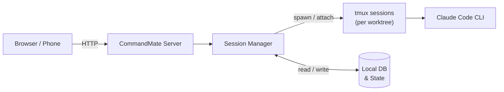

# CommandMate


**Status: Beta**

[English](../../README.md) | [日本語](./README.md)

<!-- TODO: 30秒以内のデモGIFを追加すると導入率UP -->
<!-- 例:  -->

> **入力待ちを見逃さない、開発の相棒。PCに張り付けなくても、どこからでも。**

- **入力待ち/確認状態をリアルタイム検知** — 見逃しゼロ
- **スマホ・PCからブラウザで指示送信** — PCの前にいなくてもOK
- **Git worktree 単位でセッション管理** — 並列開発をスムーズに

```bash
npm install -g commandmate
```


## 目次

- [これは何か](#これは何か)
- [こんな人向け](#こんな人向け)
- [何が独自か](#何が独自か)
- [Quick Start（3ステップ）](#quick-start3ステップ)
- [トラブルシューティング](#トラブルシューティング)
- [仕組み](#仕組み)
- [主な機能](#主な機能)
- [ユースケース](#ユースケース)
- [セキュリティ](#セキュリティ)
- [CLI コマンド](#cli-コマンド)
- [開発者向けセットアップ](#開発者向けセットアップ)
- [FAQ](#faq)
- [ドキュメント](#ドキュメント)
- [Contributing](#contributing)

---

## これは何か

Git worktree ごとに Claude Code セッションを管理し、ブラウザから指示を送れる開発コンパニオンツールです。

通勤中・育児中・昼休み――メールに返信する感覚で「次の指示」を出し、個人開発を前に進められます。

## こんな人向け

**おすすめ：**
- 育児/会議/移動でPC前に張り付けない開発者
- Claude Code の入力待ちを見逃してフローが止まりがちな方
- Git worktree で並列開発しているが、tmux操作が面倒な方

**向かないかも：**
- GUI IDE内で完結したい方（CommandMateはターミナル/CLIベース）
- マルチユーザSaaSを求めている方（CommandMateはローカル個人利用が基本）

## 何が独自か

CommandMateはターミナルの代替ではありません。Claude Code を**補完**する3つに特化しています：

- **入力待ち検知** — Claude Codeが入力を求めた瞬間に気づける
- **返信UI** — スマホを含む、あらゆるブラウザから返信
- **worktree整理** — 複数セッションを一画面で管理

**Claude Code**、**Codex CLI**、**Gemini CLI** に対応。Strategy パターンによる拡張可能な設計で、新しいCLIツールの追加も容易です。

---

## Quick Start（3ステップ）

**前提条件：** macOS / Linux、Node.js v20+、npm、git、tmux、openssl

> tmux 依存のため Windows は非対応です。WSL2 上での動作は未検証です。

```bash
# 1. インストール
npm install -g commandmate

# 2. 初期化（依存チェック、環境設定、DB初期化）
commandmate init

# 3. 起動
commandmate start --daemon
```

ブラウザで http://localhost:3000 にアクセスしてください。

**よく使うコマンド：**

```bash
commandmate status    # サーバー状態確認
commandmate stop      # サーバー停止
```

詳しくは [CLI セットアップガイド](../user-guide/cli-setup-guide.md) を参照してください。

---

## トラブルシューティング

**Claude CLI が見つからない / パスが変わった？**
Claude CLI の npm 版とスタンドアロン版を切り替えるとパスが変わることがあります。CommandMate は次のセッション起動時に自動検出します。カスタムパスを設定するには `.env` に `CLAUDE_PATH=/path/to/claude` を追加してください。

**ポート競合？**
```bash
commandmate start -p 3001
```

**セッションが固まっている / 応答がない？**
tmux セッションを直接確認できます。CommandMate は `mcbd-{ツール名}-{worktree名}` の形式でセッションを管理しています：

```bash
# CommandMate が管理しているセッション一覧を確認
tmux list-sessions | grep mcbd

# 特定セッションの出力を確認（アタッチせずに）
tmux capture-pane -t "mcbd-claude-feature-123" -p

# セッションにアタッチして確認（detach は Ctrl+b → d）
tmux attach -t "mcbd-claude-feature-123"

# 壊れたセッションを手動で削除
tmux kill-session -t "mcbd-claude-feature-123"
```

> **注意：** アタッチ中にセッション内で直接入力すると、CommandMateのセッション管理と干渉する可能性があります。`Ctrl+b` → `d` でdetachし、CommandMate UIから操作してください。

**Claude Code 内から起動するとセッション開始に失敗する？**
Claude Code は `CLAUDECODE=1` を設定してネストを防止しています。CommandMate は自動で除去しますが、問題が続く場合は `tmux set-environment -g -u CLAUDECODE` を実行してください。

---

## 仕組み

CommandMate は Claude Code（CLI）を"実行セッション"として管理し、状態（処理中/入力待ち/アイドル）をWeb UIで可視化します。



Git worktree ごとに専用の tmux セッションが割り当てられるため、複数タスクを干渉なく並列実行できます。

---

## 主な機能

- **入力待ち/確認検知** — サイドバーでリアルタイムにステータス表示（idle/ready/running/waiting）
- **ブラウザから指示送信** — スマホ・PCどちらからでもメッセージUIで操作
- **実行履歴・メモ** — ブランチごとの会話履歴を保持、メモ機能付き
- **Markdownログビューア** — Claude の詳細出力をMarkdownで閲覧
- **ファイルビューア** — ワークツリー内のファイルをブラウザから確認、ファイル操作（移動、コピー、削除）
- **ファイルタイムスタンプ** — ファイルツリーにファイル作成時刻を表示
- **Auto Yes モード** — 確認ダイアログ付きで自動承認を制御
- **リポジトリ管理** — 不要になったリポジトリをアプリ管理から解除（実ファイルは削除しません）
- **クローンURL登録** — HTTPS/SSH URLを指定してリポジトリをクローン・登録
- **マルチCLI対応** — Claude Code に最適化、Codex CLI / Gemini CLI にも対応
- **レスポンシブUI** — デスクトップは2カラム、モバイルはタブベースで最適表示

<details>
<summary>スクリーンショット</summary>

### ワークツリー詳細画面（Message / Console / History）

| PC表示 | スマホ（History） | スマホ（Terminal） |
|--------|-------------------|-------------------|
|  |  |  |

### トップ画面（スマホ）


</details>

---

## ユースケース

### 1. 通勤中 — 入力待ちを回収

- **朝：** 出かける前に Claude Code にタスクを投げておく
- **通勤：** スマホで状況確認 → 追加指示を送る
- **帰宅：** 成果物をレビューしてマージ

### 2. 育児の合間 — 5分の隙間で前に進める

- worktree をタスクごとに分けて走らせる
- CommandMate で「今どれが止まっているか」を把握
- 5分の隙間で次の一手だけ返して流れを継続

### 3. 並列開発 — 全worktreeを一画面で管理

- tmux のペインを手動で切り替える必要なし
- サイドバーで全 worktree の状態を一覧確認
- ターミナル管理ではなく、判断に集中

---

## セキュリティ

CommandMate は**完全にローカルで動作**します。アプリ本体・データベース・セッションはすべてマシン上で完結します。外部通信は Claude CLI 自体の API 呼び出しのみです。

**推奨構成：**
- `localhost` または同一LAN内で使用
- 外出先からのアクセスは VPN または認証付きリバースプロキシ（Basic認証、OIDCなど）を使用
- `commandmate init` で外部アクセスを有効にすると `CM_BIND=0.0.0.0` が設定され、同一LAN内から `http://<PCのIP>:3000` でアクセス可能

**やってはいけないこと：**
- 認証なしでインターネットに公開（`0.0.0.0` バインド時はリバースプロキシ必須）

詳細は [セキュリティガイド](../security-guide.md) と [Trust & Safety](../TRUST_AND_SAFETY.md) を参照してください。

---

## CLI コマンド

### 基本

| コマンド | 説明 |
|---------|------|
| `commandmate init` | 初期設定（対話形式） |
| `commandmate init --defaults` | 初期設定（デフォルト値） |
| `commandmate init --force` | 既存設定を上書き |
| `commandmate start` | サーバー起動（フォアグラウンド） |
| `commandmate start --daemon` | バックグラウンド起動 |
| `commandmate start --dev` | 開発モードで起動 |
| `commandmate start -p 3001` | ポート指定で起動 |
| `commandmate stop` | サーバー停止 |
| `commandmate stop --force` | 強制停止（SIGKILL） |
| `commandmate status` | 状態確認 |

### Worktree 並列開発

Issue/worktree ごとにサーバーを分離起動し、自動ポート割当で並列開発が可能です。

| コマンド | 説明 |
|---------|------|
| `commandmate start --issue 123` | Issue #123 用サーバー起動 |
| `commandmate start --issue 123 --auto-port` | 自動ポート割当で起動 |
| `commandmate start --issue 123 -p 3123` | 特定ポートで起動 |
| `commandmate stop --issue 123` | Issue #123 用サーバー停止 |
| `commandmate status --issue 123` | Issue #123 用サーバー状態確認 |
| `commandmate status --all` | 全サーバー状態確認 |

### GitHub Issue 管理

[gh CLI](https://cli.github.com/) のインストールが必要です。

| コマンド | 説明 |
|---------|------|
| `commandmate issue create` | Issue を作成 |
| `commandmate issue create --bug` | バグ報告テンプレートで作成 |
| `commandmate issue create --feature` | 機能リクエストテンプレートで作成 |
| `commandmate issue create --question` | 質問テンプレートで作成 |
| `commandmate issue create --title <title>` | タイトルを指定 |
| `commandmate issue create --body <body>` | 本文を指定 |
| `commandmate issue create --labels <labels>` | ラベルを追加（カンマ区切り） |
| `commandmate issue search <query>` | Issue を検索 |
| `commandmate issue list` | Issue 一覧 |

### ドキュメント参照

| コマンド | 説明 |
|---------|------|
| `commandmate docs` | ドキュメント表示 |
| `commandmate docs -s <section>` | 特定セクションを表示 |
| `commandmate docs -q <query>` | ドキュメント検索 |
| `commandmate docs --all` | 全セクション一覧 |

全オプションは `commandmate --help` で確認できます。

---

## 開発者向けセットアップ

コントリビューターや開発環境を構築する場合は、git clone を使用してください。

```bash
git clone https://github.com/Kewton/CommandMate.git
cd CommandMate
./scripts/setup.sh  # 依存チェック、環境設定、ビルド、起動まで自動実行
```

<details>
<summary>手動セットアップ（カスタマイズしたい場合）</summary>

```bash
git clone https://github.com/Kewton/CommandMate.git
cd CommandMate
./scripts/preflight-check.sh          # 依存チェック
npm install
./scripts/setup-env.sh                # 対話式で .env を生成
npm run db:init
npm run build
npm start
```

> **Note**: `./scripts/*` スクリプトは開発環境でのみ使用可能です。グローバルインストール（`npm install -g`）では `commandmate` CLI を使用してください。

> **Note**: 旧名称の環境変数（`MCBD_*`）も後方互換性のためサポートされていますが、新名称（`CM_*`）の使用を推奨します。

</details>

---

## FAQ

**Q: tmux は必須？**
A: CommandMate は内部で tmux を使用してCLIセッションを管理しています。ユーザーが tmux を直接操作する必要はありません。問題が発生した場合は tmux コマンドでセッションを確認できます（[トラブルシューティング](#トラブルシューティング)を参照）。

**Q: Claude Code の権限はどうなる？**
A: Claude Code 自体の権限設定がそのまま適用されます。本ツールが権限を拡張することはありません。詳しくは [Trust & Safety](../TRUST_AND_SAFETY.md) を参照してください。

**Q: 複数人で使える？**
A: 現時点では個人利用を想定しています。複数人での同時利用は未対応です。

---

## ドキュメント

| ドキュメント | 説明 |
|-------------|------|
| [CLI セットアップガイド](../user-guide/cli-setup-guide.md) | インストールと初期設定 |
| [Webアプリ操作ガイド](../user-guide/webapp-guide.md) | Webアプリの基本操作 |
| [クイックスタート](../user-guide/quick-start.md) | Claude Codeコマンドの使い方 |
| [コンセプト](../concept.md) | ビジョンと解決する課題 |
| [アーキテクチャ](../architecture.md) | システム設計 |
| [デプロイガイド](../DEPLOYMENT.md) | 本番環境構築手順 |
| [移行ガイド](../migration-to-commandmate.md) | MyCodeBranchDesk からの移行手順 |
| [UI/UXガイド](../UI_UX_GUIDE.md) | UI実装の詳細 |
| [Trust & Safety](../TRUST_AND_SAFETY.md) | セキュリティと権限の考え方 |

## Contributing

バグ報告・機能提案・ドキュメント改善を歓迎します。詳しくは [CONTRIBUTING.md](../../CONTRIBUTING.md) を参照してください。

## License

[MIT License](../../LICENSE) - Copyright (c) 2026 Kewton
